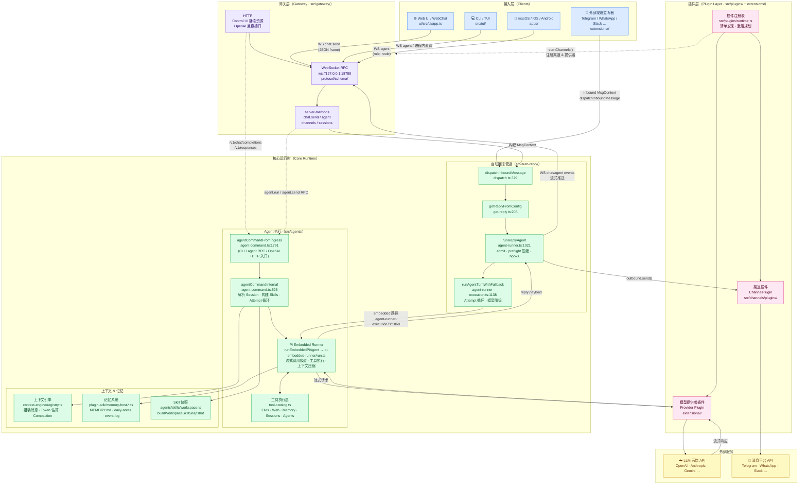

# OpenClaw 架构设计文档

> 基于源码分析，聚焦核心模块的设计与实现。

---

## 架构图

下图覆盖用户通过 **Web 界面**（Control UI / WebChat）或**命令行**（CLI / TUI）与 OpenClaw 对话的完整链路。



**图例说明**

| 层 | 颜色 | 关键路径 |
|----|------|---------|
| 接入层 | 蓝 | Web UI 或 CLI 通过 WebSocket 发送 `chat.send` / `agent` 帧；外部渠道监听器直接构造 `MsgContext` |
| 网关层 | 紫 | `server-methods/chat.ts` 解析帧 → 构建 `MsgContext` |
| 核心运行时 | 绿 | 两条 host 路径汇入同一个 Pi 运行时：<br/>· webchat / 渠道：`dispatchInboundMessage` → `getReplyFromConfig` → `runReplyAgent` → `runAgentTurnWithFallback` → `runEmbeddedPiAgent`<br/>· CLI / agent RPC / OpenAI HTTP：`agentCommandFromIngress` → `agentCommandInternal` → `runEmbeddedPiAgent`<br/>Pi 主循环负责工具执行、上下文压缩、记忆读写 |
| 插件层 | 粉 | 启动时加载渠道/提供者插件；运行时路由模型调用与消息投递 |
| 外部服务 | 黄 | LLM 云端 API（流式）+ 各消息平台 API |

## 目录

1. [项目概览](#1-项目概览)
2. [Agent 主循环流程](#2-agent-主循环流程)
3. [记忆管理](#3-记忆管理)
4. [上下文管理](#4-上下文管理)
5. [Skill 管理](#5-skill-管理)
6. [工具管理](#6-工具管理)
7. [主/子 Agent](#7-主子-agent)
8. [Agent Team 管理](#8-agent-team-管理)

---

## 1. 项目概览

OpenClaw 是一个运行在用户设备上的个人 AI 助手网关，支持多消息渠道（WhatsApp、Telegram、Slack、Discord 等）。核心是一个嵌入式 Agent 运行时（Pi），通过插件化架构实现上下文管理、记忆存储、技能调用和多 Agent 协作。

**技术栈：** TypeScript / Node.js  
**核心目录：**

```
src/
├── agents/                    # Agent 核心逻辑
│   ├── agent-command.ts       # Agent 执行入口
│   ├── pi-embedded-runner/    # 嵌入式运行时（主循环）
│   ├── skills/                # Skill 管理
│   ├── subagent-*.ts          # 子 Agent 系统
│   └── tool-catalog.ts        # 工具目录
├── context-engine/            # 上下文引擎（可插拔）
├── plugin-sdk/                # 插件 SDK（含记忆 API）
└── gateway/                   # RPC 网关
```

---

## 2. Agent 主循环流程

### 2.1 两条 host 入口路径

OpenClaw 的 Agent 执行有 **两条入口路径**，根据用户从哪里发起对话而不同。它们是**两个不同的 host**，但**最终都汇入同一份 Pi 嵌入式运行时**（`runEmbeddedPiAgent`）去做真正的模型调用、工具执行、上下文压缩。

```
                    ┌─────────────────────────────────────────────┐
   webchat / 渠道   │  auto-reply 管线（src/auto-reply/）          │
   消息（chat.send）│   dispatch → getReplyFromConfig             │
   ────────────────►│   → runReplyAgent → runAgentTurnWithFallback│──┐
                    │   （含 admit / preflight 压缩 / hook 等）    │  │
                    └─────────────────────────────────────────────┘  │
                                                                     ▼
                                                          ┌──────────────────────┐
                                                          │  runEmbeddedPiAgent  │
   CLI / agent RPC  ┌─────────────────────────────────────┤  src/agents/         │
   /v1/chat/completions │ agentCommandFromIngress         │  pi-embedded.ts      │
   ────────────────►│ → agentCommand                      ├──┤  pi-embedded-runner│
                    │ → agentCommandInternal              │  │  （流式调模型/工具/│
                    │   （Attempt 循环 / 模型降级 / 压缩）│  │   压缩/Auth 切换） │
                    └─────────────────────────────────────┘  └──────────────────────┘
```

两条路径分工：

| 入口路径 | 触发场景 | host 职责 |
|---------|---------|----------|
| auto-reply 管线 | 浏览器 webchat、Telegram/WhatsApp/Slack 等渠道消息 | 决定**要不要回**（admit、群聊去抖、freshness）、跑 hooks、调度 reply |
| `agent-command.ts` | CLI 直跑、`agent.run`/`agent.send` WS RPC、`/v1/chat/completions` 等 OpenAI 兼容 HTTP | 一次性命令式调用，不需要会话门控 |

> **常见误区**：很多人以为 webchat 也走 `agent-command.ts`，实际不会。详见 [2.4 webchat 完整调用链](#24-webchat-chat-消息从入口到-llm-的完整调用链)。

### 2.2 入口 A：`agent-command.ts`（CLI / agent RPC / OpenAI HTTP）

**文件：** `src/agents/agent-command.ts`

```
agentCommandFromIngress()          ← agent-command.ts:1791   网络入口，面向外部调用者
    ↓
agentCommand()                     ← agent-command.ts:1763   受信任操作者入口
    ↓
agentCommandInternal()             ← agent-command.ts:526    核心实现
    ├─ 解析 Session / 模型 / Auth
    ├─ 构建 Skills Snapshot
    ├─ 执行 Attempt 循环（含重试/降级）
    │   ├─ 组装上下文消息
    │   ├─ 调用模型 API（流式）
    │   ├─ 处理 Tool Call
    │   ├─ 上下文溢出 → 触发 Compaction
    │   └─ 失败 → 切换模型/Auth Profile 重试
    ├─ 格式化 Reply Payload
    ├─ 投递到渠道
    └─ 持久化 Session 状态
```

| 函数 | 行号 | 说明 |
|------|------|------|
| `agentCommandFromIngress` | 1791 | 网络入口，面向外部调用者 |
| `agentCommand` | 1763 | 受信任操作者入口 |
| `agentCommandInternal` | 526 | 核心实现，包含完整执行逻辑 |
| `prepareAgentCommandExecution` | 324 | 准备阶段：解析配置、模型、Auth、工作区 |
| `persistSessionEntry` | 270 | 持久化 Session 条目 |
| `normalizeExplicitOverrideInput` | 309 | 校验并规范化 provider/model 覆盖输入 |

**`agentCommandInternal` 关键逻辑（526-800 行）：**
- 526：函数入口，接收 `AgentCommandOpts`、`RuntimeEnv`、可选 `CliDeps`
- 686-738：Session 条目准备与 Transcript 持久化
- 783：`buildSkillsSnapshot` 异步构建技能快照

> 走哪条 attempt/降级实现取决于 host：`agentCommandInternal` 自己有一套 attempt 循环；webchat 那条则在 `runAgentTurnWithFallback` 里另有一套。两套 host 逻辑独立，但最后都通过 `runEmbeddedPiAgent` 调 LLM。

### 2.3 入口 B：auto-reply 管线（webchat / 渠道消息）

**目录：** `src/auto-reply/`

webchat 与所有外部渠道（Telegram / WhatsApp / Slack 等）走的是这条。它**不会经过 `agent-command.ts`**，而是从 `dispatchInboundMessage` 进 auto-reply 管线，在管线里跑会话级门控（要不要回、是否压缩、hooks 等），最后直接调 `runEmbeddedPiAgent`。

| 函数 | 文件:行号 | 说明 |
|------|----------|------|
| `dispatchInboundMessage` | `src/auto-reply/dispatch.ts:379` | 入站消息总入口 |
| `dispatchReplyFromConfig` | `src/auto-reply/reply/dispatch-from-config.ts:789` | 通过 lazy import 拿 `getReplyFromConfig` |
| `getReplyFromConfig` | `src/auto-reply/reply/get-reply.ts:206` | 解析 agentId/provider/model，跑 `before_agent_reply` hook |
| `runPreparedReply` | `src/auto-reply/reply/get-reply-run.ts:389` | 懒加载 agent runtime，拿 `runReplyAgent` |
| `runReplyAgent` | `src/auto-reply/reply/agent-runner.ts:1021` | admit / preflight 压缩 / memory flush / 组 prompt |
| `runAgentTurnWithFallback` | `src/auto-reply/reply/agent-runner-execution.ts:1138` | Attempt 循环 + 模型降级（独立于 `agent-command.ts` 的实现） |
| `runEmbeddedPiAgent`（调用点） | `src/auto-reply/reply/agent-runner-execution.ts:1869` | 进入 Pi 运行时，开始与 LLM 实际交互 |

`runAgentTurnWithFallback` 内部按 agent / 模型策略二选一：
- **CLI agent 路径**：`runCliAgentWithLifecycle`（`agent-runner-execution.ts:1735` → 实现 `agent-runner-cli-dispatch.ts:57`），走外部 CLI（claude/codex 等）
- **Embedded Pi 路径**：`runEmbeddedPiAgent`（`agent-runner-execution.ts:1869` → 实现 `src/agents/pi-embedded.ts`），走嵌入式 Pi runtime 直接调 LLM

走哪条由 `resolveAgentHarnessPolicy()` 根据当前 agent / 模型配置决定。**本仓库默认 webchat + 自建 OpenAI 兼容模型走的是 embedded 路径。**

### 2.4 webchat `/chat` 消息从入口到 LLM 的完整调用链

调试 webchat 时一个常见的误区是「以为 `/chat` 走的是 `agent-command.ts`」。实际不是——它走 [2.3 auto-reply 管线](#23-入口-bauto-reply-管线webchat--渠道消息)。`agent-command.ts` 是 [2.2 入口 A](#22-入口-aagent-commandtscli--agent-rpc--openai-http) 的入口，断点要打在对应位置才会命中。

完整链路如下（顺着 `→` 一路加断点都能停）：

```
浏览器 /chat 发消息
  └─→ WS method: "chat.send"
       file: src/gateway/server-methods/chat.ts:2290     ← 入口 handler
       │
       └─→ dispatchInboundMessage()
            file: src/auto-reply/dispatch.ts:379
            │
            └─→ dispatchReplyFromConfig()
                 file: src/auto-reply/reply/dispatch-from-config.ts:789
                 │  内部通过 lazy import 拿到 getReplyFromConfig
                 │
                 └─→ getReplyFromConfig()
                      file: src/auto-reply/reply/get-reply.ts:206
                      │  解析 agentId / provider / model / thinkingLevel /
                      │  reasoningLevel 等，跑 before_agent_reply hook，
                      │  最后 return runPreparedReply(...)
                      │
                      └─→ runPreparedReply()
                           file: src/auto-reply/reply/get-reply-run.ts:389
                           │  懒加载 agent-runner.runtime.ts，
                           │  拿到 runReplyAgent 后调用
                           │
                           └─→ runReplyAgent()
                                file: src/auto-reply/reply/agent-runner.ts:1021
                                │  跑 admit / preflight 压缩 / memory flush /
                                │  build prompt 等准备工作。最关键的一行：
                                │
                                │    await traceAgentPhase("reply.run_agent_turn", () =>
                                │      runAgentTurnWithFallback({...}))
                                │  位置：agent-runner.ts:1466
                                │
                                └─→ runAgentTurnWithFallback()
                                     file: src/auto-reply/reply/agent-runner-execution.ts:1138
                                     │
                                     ├─[CLI agent 路径]
                                     │  runCliAgentWithLifecycle()
                                     │  位置：agent-runner-execution.ts:1735
                                     │  实现：agent-runner-cli-dispatch.ts:57
                                     │  → 走外部 CLI(claude/codex 等)
                                     │
                                     └─[Embedded Pi agent 路径]
                                        runEmbeddedPiAgent()
                                        位置：agent-runner-execution.ts:1869
                                        实现：src/agents/pi-embedded.ts
                                        → 走嵌入式 Pi runtime 直接调 LLM
```

#### 想调试什么 → 在哪里下断点

| 想看的东西                       | 文件 : 行号                                                |
| --------------------------- | ------------------------------------------------------ |
| 消息进 gateway 的第一站            | `src/gateway/server-methods/chat.ts:2290`              |
| auto-reply pipeline 入口      | `src/auto-reply/dispatch.ts:379`                       |
| provider/model/agentId 解析完毕 | `src/auto-reply/reply/get-reply.ts:240` 附近             |
| before_agent_reply hook 触发  | `get-reply.ts:830` 附近的 `runBeforeAgentReply`           |
| Agent turn 真正开始             | `src/auto-reply/reply/agent-runner.ts:1466`            |
| 选择 CLI vs embedded 分支       | `src/auto-reply/reply/agent-runner-execution.ts:1735` 与 `:1869` |
| LLM 实际请求(embedded)         | 进 `src/agents/pi-embedded.ts` 之后 `runEmbeddedPiAgent`  |

#### `agent-command.ts` 什么时候才会被命中

只有这三种入口会命中 `agent-command.ts:agentCommandFromIngress` / `agentCommandInternal`：

1. `node openclaw.mjs --dev agent run ...` —— CLI 直跑
2. `agent.run` / `agent.send` 这类 WS RPC（不是 `chat.send`）
3. OpenAI 兼容 HTTP：`/v1/chat/completions`、`/v1/responses`
   （文件：`src/gateway/openai-http.ts`、`src/gateway/openresponses-http.ts`）

如果你只是在浏览器 `/chat` 里聊天，**这三条都不会走**，所以断点永远不会停。
要测 `agent-command.ts` 的代码，最快的办法是手动调一下 OpenAI 兼容接口：

```bash
curl -sS http://127.0.0.1:19001/v1/chat/completions \
  -H "Authorization: Bearer $(jq -r .gateway.auth.token ~/.openclaw-dev/openclaw.json)" \
  -H "Content-Type: application/json" \
  -d '{"model":"qwen3.5","messages":[{"role":"user","content":"hi"}]}'
```

这条请求会进 `openai-http.ts:975` → `agentCommandFromIngress` → `agentCommandInternal:526`，
断点就会停在 532 行。

### 2.5 嵌入式运行时（Pi Runner）

**文件：** `src/agents/pi-embedded-runner/run.ts`

| 函数 | 行号 | 说明 |
|------|------|------|
| `resolveAttemptDispatchApiKey` | 209 | 解析 Attempt 的 API Key |
| `resolveEmbeddedRunLaneTimeoutMs` | 219 | 计算 Lane 超时（含宽限期） |
| `withEmbeddedRunLaneTimeout` | 226 | 将超时应用到命令队列选项 |
| `resolveEmbeddedRunSessionQueuePriority` | 236 | 根据触发类型确定队列优先级 |
| `normalizeEmbeddedRunAttemptResult` | 253 | 规范化 Attempt 结果 |
| `hasCompletedModelProgressForIdleBreaker` | 288 | 检查模型是否有进展（用于空闲超时） |
| `createEmbeddedRunAuthController` | 900 | 初始化 Auth 控制器 |
| `advancePluginHarnessAuthProfile` | 947 | 推进 Auth Profile（异步） |
| `resolveSessionAgentIds` | 995 | 解析 Session 的 Agent ID 列表 |
| `resolvePluginHarnessProfileOrder` | 744 | 解析 Auth Profile 顺序 |

**关键常量：**
```typescript
MAX_SAME_MODEL_IDLE_TIMEOUT_RETRIES = 1        // run.ts:201
EMBEDDED_RUN_LANE_TIMEOUT_GRACE_MS = 30_000    // run.ts:202
```

### 2.6 Run 生命周期管理

**文件：** `src/agents/pi-embedded-runner/runs.ts`

| 函数 | 行号 | 说明 |
|------|------|------|
| `queueEmbeddedPiMessageWithOutcome` | 144 | 同步消息入队（含结果等待） |
| `queueEmbeddedPiMessageWithOutcomeAsync` | 174 | 异步消息入队 |
| `abortEmbeddedPiRun` | 274 | 中止单个或多个 Run |
| `isEmbeddedPiRunActive` | 337 | 检查 Run 是否活跃 |
| `isEmbeddedPiRunStreaming` | 353 | 检查 Run 是否正在流式输出 |
| `waitForActiveEmbeddedRuns` | 430 | 等待所有活跃 Run 完成 |
| `waitForEmbeddedPiRunEnd` | 460 | 等待特定 Run 结束 |
| `abortAndDrainEmbeddedPiRun` | 503 | 中止并等待 Run 排空 |
| `setActiveEmbeddedRun` | 533 | 注册活跃 Run |
| `clearActiveEmbeddedRun` | 563 | 注销已完成 Run |
| `forceClearEmbeddedPiRun` | 588 | 强制清理卡住的 Run |

**Run 状态机：**
```
pending → active → streaming → compacting → completed
                                          ↘ aborted
```

---

## 3. 记忆管理

### 3.1 架构概览

记忆系统基于文件存储，通过 Plugin SDK 暴露 API，支持多种记忆制品（Artifact）类型。

**存储路径：**
```
~/.openclaw/agents/<agentId>/
├── memory/
│   ├── MEMORY.md              # 记忆索引文件
│   ├── daily-notes/           # 每日笔记
│   └── dreaming/              # Dream 报告
└── sessions/                  # Session 存储
```

### 3.2 核心 API

**文件：** `src/plugin-sdk/memory-host-core.ts`

| 函数 | 行号 | 说明 |
|------|------|------|
| `pathExists` | 10 | 检查路径是否存在 |
| `listMarkdownFilesRecursive` | 19 | 递归列出 Markdown 文件 |
| `listMemoryWorkspacePublicArtifacts` | 35 | 收集单个工作区的记忆制品 |
| `listMemoryHostPublicArtifacts` | 90 | 聚合所有工作区的记忆制品 |

**`listMemoryWorkspacePublicArtifacts`（35行）** 收集以下制品：
- `MEMORY.md` — 根记忆文件
- `memory/daily-notes/` — 每日笔记（Markdown）
- `memory/dreaming/` — Dream 报告（Markdown）
- 事件日志（JSON）

### 3.3 记忆制品类型

```typescript
type MemoryPluginPublicArtifact = {
  type: "memory-md" | "daily-note" | "dream-report" | "event-log"
  path: string
  content: string
}
```

### 3.4 记忆写入流程

```
Agent 执行结束
    ↓
memory-host-events.ts     # 记录事件日志
    ↓
memory-host-markdown.ts   # 写入 Markdown 记忆
    ↓
memory-host-search.ts     # 更新搜索索引
```

---

## 4. 上下文管理

### 4.1 上下文引擎（可插拔）

上下文引擎是一个插件化系统，支持多种实现（memory-core、legacy 等）。

**文件：** `src/context-engine/registry.ts`

| 函数 | 行号 | 说明 |
|------|------|------|
| `registerContextEngine` | 406 | 第三方注册上下文引擎（公开 SDK 入口） |
| `registerContextEngineForOwner` | 374 | 带 owner 校验的注册 |
| `getContextEngineFactory` | 416 | 获取已注册引擎的工厂函数 |
| `listContextEngineIds` | 423 | 列出所有已注册引擎 ID |
| `resolveContextEngine` | 527 | **主解析函数**，含降级逻辑 |
| `resolveDefaultContextEngine` | 610 | 解析默认引擎（降级用） |
| `clearContextEnginesForOwner` | 427 | 清除特定 owner 的引擎 |
| `resolveContextEngineOwnerPluginId` | 440 | 返回注册该引擎的插件 ID |

**关键常量：**
```typescript
CORE_CONTEXT_ENGINE_OWNER = "core"          // registry.ts:335
PUBLIC_CONTEXT_ENGINE_OWNER = "public-sdk"  // registry.ts:336
```

**向后兼容层（38行）：**
```typescript
SESSION_KEY_COMPAT_METHODS  // 支持旧版 sessionKey 参数的方法列表
wrapContextEngineWithSessionKeyCompat  // 代理包装器（270行）
```

### 4.2 上下文组装流程

```
resolveContextEngine()              ← context-engine/registry.ts:527
    ↓
ContextEngine.assemble()            ← context-engine/types.ts
    ↓
AssembleResult {
  messages: Message[]               # 有序消息列表
  estimatedTokens: number           # Token 估算
  systemPromptAddition?: string     # 可选系统提示追加
  projectionMode: "per-turn" | "thread-bootstrap"
}
    ↓
上下文溢出检测
    ↓（溢出时）
Compaction 流程
```

### 4.3 上下文压缩（Compaction）

**文件：** `src/agents/pi-embedded-runner/compact.ts`

| 函数 | 行号 | 说明 |
|------|------|------|
| `prepareCompactionSessionAgent` | 186 | 为压缩准备 Agent 配置 |
| `resolveCompactionProviderStream` | 248 | 解析压缩用的 Provider 流 |
| `summarizeCompactionMessages` | 297 | 收集压缩指标 |
| `containsRealConversationMessages` | 354 | 校验是否有真实对话消息 |
| `compactEmbeddedPiSessionDirect` | 415 | **核心压缩函数**（不含 Lane 排队） |
| `compactEmbeddedPiSessionDirectOnce` | 476 | 单次压缩尝试（含完整生命周期） |

**压缩流程：**
```
检测到上下文溢出
    ↓
compactEmbeddedPiSessionDirectOnce()    ← compact.ts:476
    ├─ prepareCompactionSessionAgent()  ← compact.ts:186
    ├─ resolveCompactionProviderStream()← compact.ts:248
    ├─ 调用模型生成摘要
    ├─ 旋转 Transcript
    └─ 触发 compaction-hooks.ts 后置钩子
```

**相关文件：**
- `compact.types.ts` — 压缩类型定义
- `compact.hooks.ts` — 压缩钩子
- `compaction-safety-timeout.ts` — 压缩安全超时
- `compaction-hooks.ts` — 压缩后置副作用

---

## 5. Skill 管理

### 5.1 架构概览

Skill 是可调用的能力单元，从工作区目录加载，经过过滤后注入模型的系统提示。

**文件：** `src/agents/skills/workspace.ts`（1326 行）

| 函数 | 行号 | 说明 |
|------|------|------|
| `loadSkillEntries` | 606 | **主加载器**，从多个来源加载 Skill |
| `loadGeneratedPluginSkillRecords` | 515 | 加载插件生成的 Skill 记录 |
| `resolveWorkspaceSkillPromptState` | 1095 | 解析可用 Skill 并生成提示文本 |
| `applySkillsPromptLimits` | 990 | 应用字符/数量限制，超限时降级为紧凑格式 |
| `formatSkillsCompact` | 968 | 紧凑格式（仅名称+位置） |
| `buildWorkspaceSkillSnapshot` | 1042 | 构建 Skill 快照（含提示、元数据） |
| `buildWorkspaceSkillsPrompt` | 1061 | 生成 Skill 提示字符串 |
| `loadWorkspaceSkillEntries` | 1163 | 加载并过滤工作区 Skill 条目 |
| `loadVisibleWorkspaceSkillEntries` | 1183 | 加载可见（已过滤）Skill 条目 |
| `syncSkillsToWorkspace` | 1240 | 同步 Skill 到目标工作区 |
| `filterWorkspaceSkillEntries` | 1308 | 按配置过滤 Skill 条目 |
| `filterWorkspaceSkillEntriesWithOptions` | 1315 | 带选项过滤（skillFilter、eligibility） |

**`loadSkillEntries`（606行）加载来源：**
1. 捆绑 Skill（bundled）
2. 额外 Skill（extra）
3. 托管 Skill（managed）
4. 个人 Agent Skill
5. 项目 Agent Skill
6. 工作区来源 Skill

### 5.2 Skill 加载流程

```
agentCommandInternal()              ← agent-command.ts:526
    ↓
buildSkillsSnapshot()               ← agent-command.ts:783
    ↓
buildWorkspaceSkillSnapshot()       ← skills/workspace.ts:1042
    ├─ loadWorkspaceSkillEntries()  ← skills/workspace.ts:1163
    │   └─ loadSkillEntries()       ← skills/workspace.ts:606
    ├─ resolveWorkspaceSkillPromptState() ← skills/workspace.ts:1095
    │   └─ applySkillsPromptLimits()← skills/workspace.ts:990
    └─ 返回 SkillSnapshot { prompt, skills, resolvedSkills }
```

### 5.3 Skill 快照结构

```typescript
type SkillSnapshot = {
  prompt: string           // 注入模型的技能描述文本
  skills: SkillEntry[]     // 原始技能条目
  resolvedSkills: ResolvedSkill[]  // 解析后的技能（含环境覆盖）
}
```

---

## 6. 工具管理

### 6.1 工具目录

**文件：** `src/agents/tool-catalog.ts`

| 类型/常量 | 行号 | 说明 |
|-----------|------|------|
| `ToolProfileId` | 13 | `"minimal" \| "coding" \| "messaging" \| "full"` |
| `ToolProfilePolicy` | 15 | 工具 Profile 的允许/拒绝列表 |
| `CoreToolSection` | 20 | 工具分区（含 id、label、tools 数组） |
| `CoreToolDefinition` | 30 | 工具定义（含 Profile 资格） |
| `CORE_TOOL_SECTION_ORDER` | 39 | 工具分区有序列表 |
| `CORE_TOOL_DEFINITIONS` | 53 | **核心工具定义数组** |

**工具分区（`CORE_TOOL_SECTION_ORDER`，39行）：**

| 分区 | 包含工具 |
|------|---------|
| Files | read, write, edit, apply_patch |
| Runtime | exec, process, code_execution |
| Web | web_search, web_fetch, x_search |
| Memory | memory_search, memory_get |
| Sessions | sessions_list, sessions_history, sessions_send |
| Agents | sessions_spawn, sessions_yield, subagents |
| UI | session_status |
| Messaging | （渠道相关工具） |
| Automation | （自动化工具） |

### 6.2 工具执行流程

```
模型返回 Tool Call
    ↓
tool-name-allowlist.ts      # 校验工具名是否在允许列表
    ↓
tool-policy.ts              # 执行策略（allow/deny）
    ↓
tool-catalog.ts             # 路由到对应处理器
    ↓
工具执行
    ↓
tool-result-truncation.ts   # 截断过大结果
    ↓
tool-result-context-guard.ts # 防止上下文溢出
    ↓
返回结果给模型
```

**相关文件：**
- `tool-schema-runtime.ts` — 运行时工具 Schema 解析
- `tool-policy.ts` — 工具执行策略
- `tool-loop-detection.ts` — 无限工具循环检测
- `tool-mutation.ts` — 工具变更追踪
- `effective-tool-policy.ts` — 有效策略计算（pi-embedded-runner/）

---

## 7. 主/子 Agent

### 7.1 子 Agent 生命周期

```
父 Agent 发起 Spawn（Tool Call: sessions_spawn）
    ↓
subagent-spawn.ts
    ├─ resolveConfiguredAgentIds()      ← subagent-spawn.ts:96
    ├─ 校验 Spawn 策略 & 深度限制
    ├─ buildDirectChildSessionPatch()   ← subagent-spawn.ts:238
    ├─ prepareSubagentSessionContext()  ← subagent-spawn.ts:348
    └─ prepareContextEngineSubagentSpawn() ← subagent-spawn.ts:457
    ↓
subagent-registry.ts
    ├─ 注册子 Agent Run
    ├─ 持久化到磁盘
    └─ 启动子 Agent 执行（同主循环）
    ↓
子 Agent 执行完成
    ↓
subagent-announce.ts        # 向父 Agent 通知结果
    ↓
父 Agent 继续执行
```

### 7.2 子 Agent 注册表

**文件：** `src/agents/subagent-registry.ts`

| 函数 | 行号 | 说明 |
|------|------|------|
| `loadContextEngineInitModule` | 222 | 懒加载上下文引擎初始化模块 |
| `loadContextEngineRegistryModule` | 226 | 懒加载上下文引擎注册表模块 |
| `ensureSubagentRegistryPluginRuntimeLoaded` | 234 | 确保插件运行时已加载 |
| `resolveSubagentRegistryContextEngine` | 247 | 解析注册表的上下文引擎 |
| `persistSubagentRuns` | 262 | 持久化子 Agent Run 状态 |
| `scheduleSubagentOrphanRecovery` | 270 | 调度孤儿 Run 恢复 |
| `clearPendingLifecycleError` | 308 | 清除待处理的生命周期错误 |
| `schedulePendingLifecycleError` | 340 | 调度生命周期错误处理 |
| `schedulePendingLifecycleTimeout` | 377 | 调度生命周期超时 |
| `notifyContextEngineSubagentEnded` | 412 | 通知上下文引擎子 Agent 已结束 |
| `emitSubagentEndedHookForRun` | 459 | 触发子 Agent 结束钩子 |

**关键常量：**
```typescript
ORPHAN_RECOVERY_DEBOUNCE_MS = 1_000      // subagent-registry.ts:193
SUBAGENT_ANNOUNCE_TIMEOUT_MS = 120_000   // subagent-registry.ts:195
```

**依赖注入接口（97行）：**
```typescript
type SubagentRegistryDeps = {
  // 注入的依赖项，支持测试替换
}
const defaultSubagentRegistryDeps  // 默认实现，174行
```

### 7.3 子 Agent Spawn 参数

**文件：** `src/agents/subagent-spawn.ts`

| 类型/函数 | 行号 | 说明 |
|-----------|------|------|
| `SpawnSubagentParams` | 127 | Spawn 参数类型 |
| `SpawnSubagentContext` | 152 | Spawn 执行上下文 |
| `SpawnSubagentResult` | 171 | Spawn 结果类型 |
| `SubagentSpawnDeps` | 100 | 依赖注入接口 |
| `callGateway` | 200 | 与 Gateway 通信（含 Scope 管理） |
| `readGatewayRunId` | 216 | 从响应中提取 runId |
| `resolveSubagentAgentGatewayTimeoutMs` | 224 | 计算超时时间 |
| `loadSubagentConfig` | 282 | 加载子 Agent 配置 |
| `persistInitialChildSessionRuntimeModel` | 286 | 持久化子 Session 初始模型 |
| `prepareSubagentSessionContext` | 348 | 准备 Fork/隔离上下文 |
| `prepareContextEngineSubagentSpawn` | 457 | 准备上下文引擎的 Spawn |
| `rollbackPreparedContextEngine` | 494 | 回滚已准备的上下文引擎 |

**超时常量：**
```typescript
SUBAGENT_CONTROL_GATEWAY_TIMEOUT_MS = 60_000       // subagent-spawn.ts:123
DEFAULT_SUBAGENT_AGENT_GATEWAY_TIMEOUT_MS = 60_000  // subagent-spawn.ts:124
MAX_SUBAGENT_AGENT_GATEWAY_TIMEOUT_MS = 300_000     // subagent-spawn.ts:125
```

### 7.4 深度限制与孤儿恢复

- **深度限制：** `src/agents/subagent-depth.ts` — 防止无限嵌套
- **孤儿恢复：** `src/agents/subagent-orphan-recovery.ts` — 恢复异常中断的子 Agent
- **持久化：** `~/.openclaw/agents/<agentId>/subagent-runs.json`

---

## 8. Agent Team 管理

### 8.1 多 Agent 协作模型

OpenClaw 通过子 Agent 注册表实现 Agent Team，父 Agent 可以并发 Spawn 多个子 Agent，形成树状协作结构。

```
父 Agent (Root)
    ├─ 子 Agent A (sessions_spawn)
    │   └─ 孙 Agent A1（受深度限制）
    ├─ 子 Agent B (sessions_spawn)
    └─ 子 Agent C (sessions_spawn)
```

### 8.2 Team 状态查询

**文件：** `src/agents/subagent-registry-queries.ts`

核心查询能力：
- `countActiveRunsForSession()` — 统计 Session 下活跃子 Agent 数量
- `listRunsForRequester()` — 列出父 Agent 发起的所有子 Agent
- `getSubagentRunByChildSessionKey()` — 按子 Session Key 查找

### 8.3 Team 内通信

子 Agent 完成后通过 `subagent-announce.ts` 向父 Agent 通知结果，父 Agent 通过 `sessions_yield` 工具等待子 Agent 完成。

**相关文件：**
- `subagent-announce.ts` — 完成通知
- `subagent-delivery-state.ts` — 投递状态追踪
- `subagent-registry-completion.ts` — 完成事件处理
- `subagent-registry-lifecycle.ts` — 生命周期状态机
- `subagent-registry-memory.ts` — 内存中的 Run 追踪
- `subagent-registry-state.ts` — 状态持久化/恢复

### 8.4 执行契约（Execution Contract）

**文件：** `src/agents/execution-contract.ts`

不同模型使用不同执行契约：

| 契约类型 | 适用场景 | 特性 |
|---------|---------|------|
| `"default"` | 标准 Agent 执行 | 通用流程 |
| `"strict-agentic"` | GPT-5 系列模型 | 无停滞完成门控、不完整轮次恢复 |

```typescript
resolveEffectiveExecutionContract({
  config, sessionKey, agentId, provider, modelId
}) → "default" | "strict-agentic"
```

---

## 附录：关键文件速查

| 模块 | 文件路径 | 核心函数/行号 |
|------|---------|-------------|
| Agent 入口 | `src/agents/agent-command.ts` | `agentCommandInternal` L526 |
| 主循环 | `src/agents/pi-embedded-runner/run.ts` | `createEmbeddedRunAuthController` L900 |
| Run 管理 | `src/agents/pi-embedded-runner/runs.ts` | `queueEmbeddedPiMessageWithOutcome` L144 |
| 上下文压缩 | `src/agents/pi-embedded-runner/compact.ts` | `compactEmbeddedPiSessionDirect` L415 |
| 上下文引擎 | `src/context-engine/registry.ts` | `resolveContextEngine` L527 |
| 记忆 API | `src/plugin-sdk/memory-host-core.ts` | `listMemoryWorkspacePublicArtifacts` L35 |
| Skill 加载 | `src/agents/skills/workspace.ts` | `loadSkillEntries` L606 |
| 工具目录 | `src/agents/tool-catalog.ts` | `CORE_TOOL_DEFINITIONS` L53 |
| 子 Agent 注册 | `src/agents/subagent-registry.ts` | `persistSubagentRuns` L262 |
| 子 Agent Spawn | `src/agents/subagent-spawn.ts` | `prepareSubagentSessionContext` L348 |

