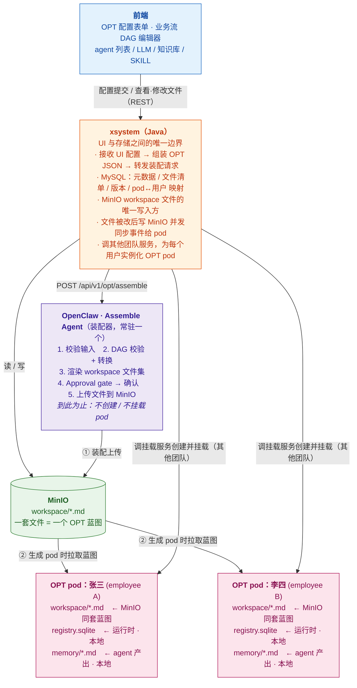

# OPT 自动装配设计文档

---

## 一、整体架构

系统由四个模块组成：

| 模块 | 职责 | 技术栈 |
|------|------|--------|
| **前端** | Web 配置界面，出 OPT 配置表单、DAG 编辑器，所有读写都调 xsystem | Web |
| **xsystem** | 后端服务，UI 与存储之间的唯一边界，操作 MySQL（元数据）和 MinIO（文件） | Java |
| **MinIO** | 对象存储，存放装配 agent 生成的 workspace markdown 文件（真源 / source of truth） | S3 兼容 |
| **OpenClaw** | 内置 Assemble Agent 的运行平台，渲染文件、上传 MinIO、挂载 pod | — |



**三类角色，职责分开看：**

- **Assemble Agent（装配器）**：常驻进程，是个 openclaw 插件（`POST /api/v1/opt/assemble`）。它**只负责生成一套 OPT 所需的 markdown 文件并上传到 MinIO**，到此为止——不创建、不挂载 pod。它与 xsystem（收装配请求）和 MinIO（写文件）交互。
- **xsystem（编排与挂载发起方）**：拿到 MinIO 里的一套文件后，**基于这套文件为每个用户生成一个 OPT pod**——挂载这一步由 xsystem 调用其他团队的服务执行，xsystem 不自己实现挂载逻辑。pod 与用户的映射记在 MySQL。
- **OPT pod（成品实例）**：每个用户一个，各自独立的 pod 和本地盘。张三、李四各有一个，互不干扰。

### 1.1 一套文件 vs 多个 OPT 的关系

```
一次装配  ──产出──▶  一套 OPT markdown 文件（蓝图，存 MinIO）
                          │
                          │ xsystem 基于这套文件
                          ▼
            ┌─────────────┼─────────────┐
            ▼             ▼             ▼
        OPT pod:张三   OPT pod:李四   OPT pod:王五   …… 每用户一个实例
```

- **装配的产物是文件，不是 pod。** 一次装配只生成一套 markdown（一个蓝图）。
- **OPT pod 是 xsystem 基于这套文件实例化出来的。** 同一套文件可以给多个用户各自生成一个 OPT pod。
- **挂载由其他团队的服务执行**，xsystem 只是发起方（传入用户标识 + MinIO 文件位置，调对方接口）。

### 1.2 什么时候产生 OPT pod

```
① 管理员在 UI 提交 OPT 配置
   → xsystem 组装 JSON，POST /api/v1/opt/assemble
   → Assemble Agent 渲染文件 → 上传 MinIO
   → 一套 OPT 蓝图就绪（此时还没有任何 pod）

② 需要给某用户开通 OPT 时（如新员工入职）
   → xsystem 基于 MinIO 里的蓝图 + 用户标识
   → 调其他团队的挂载服务 → 创建并挂载该用户的 OPT pod
   → 该用户的 OPT 诞生，开始接收消息
```

装配（生成文件）和实例化（生成 pod）是**两个独立阶段**：蓝图先就绪，用户开通时再按需生成 pod。

### 1.3 OPT 生成后，修改了 markdown 怎么传回 OPT

OPT 跑起来后，操作员可在 UI 改 workspace 文件（如调 AGENTS.md）。改动**不直接写 pod**，而是先回 MinIO 真源，再同步下行到对应 OPT pod：

```
UI 改文件
  → xsystem：① 覆盖写 MinIO 对应对象  ② 更新 MySQL 文件版本
  → xsystem 向受影响的每个 OPT pod 发同步事件
         POST /plugins/webhooks/<opt-sync-route>  （Bearer secret）
         goal: "sync_workspace: optId=hr-zhang-san, files=[AGENTS.md]"
  → openclaw webhooks 插件 → 该 OPT 的 TaskFlow
  → 同步逻辑从 MinIO 拉取变更文件 → 覆盖该 pod 本地副本 → 必要时重载 agent 配置
```

关键点：
- 一套蓝图可能被实例化成多个 pod，xsystem 按 MySQL 里的映射，**向所有基于该蓝图的 OPT pod 逐个投递同步事件**。
- 每个 OPT pod 在创建时注册一条**专属同步路由**（`sessionKey` 绑定到该 pod），xsystem 按 `optId` 投递，改谁的文件只同步谁的 pod。
- 只同步 workspace 配置文件，**SQLite 和 memory 不在同步范围**，始终留 pod 本地。
- 复用 openclaw 原生 webhooks 插件（见第四章），不新建同步通道。详细链路见 6.1。

**存储职责边界（关键）：**

- **MinIO 是 workspace 配置文件的唯一真源**，只存声明式 markdown / `.lobster` 文本文件（IDENTITY.md / SOUL.md / AGENTS.md / USER.md / TOOLS.md / HEARTBEAT.md / skills/*.SKILL.md / workflows/*.lobster）。
- **写方向单一**：装配 agent 渲染 → 上传 MinIO；UI 改文件 → xsystem 写 MinIO → 触发同步 → openclaw 从 MinIO 拉到 pod 本地。pod 本地的配置文件是只读副本。
- **SQLite（TaskFlow / task 持久化）永远留在 pod 本地盘**，绝不进 MinIO。它需要 POSIX 文件锁和 `fsync`，对象存储不具备这些语义；它是运行时状态而非配置，xsystem 也不应触碰。
- **agent 运行时产出的 memory 文件（`memory/YYYY-MM-DD.md`）只留 pod 本地**，不进 MinIO，UI 不可见。装配配置走 MinIO 单向下行，运行时状态留本地，两者不混。

---

## 二、前端配置界面

### 2.1 配置项

用户在界面上为 OPT 内每个 agent 填写以下信息：

| 配置项 | 说明 | 必填 |
|--------|------|------|
| OPT 名称 | 显示名，写入 IDENTITY.md | ✅ |
| 服务对象（姓名 / 职位） | 写入 USER.md | ✅ |
| agent 列表 | 至少一个 main agent | ✅ |
| 每个 agent：LLM 模型 | 从平台模型列表选择 | ✅ |
| 每个 agent：角色描述 | 写入 IDENTITY.md / AGENTS.md | ✅ |
| 每个 agent：性格描述 | 写入 SOUL.md | ✅ |
| 每个 agent：知识库 | 多选，生成 kb SKILL 文件 | ⬜ |
| 每个 agent：SKILL | 多选，写入 openclaw.json | ⬜ |
| 业务流 DAG | 可视化编辑器，可选 | ⬜ |
| 心跳检查项 | 周期任务列表，可选 | ⬜ |

### 2.2 提交格式

前端把配置提交给 xsystem，由 xsystem 组装为标准 OPT JSON 后转发给 openclaw 的 `POST /api/v1/opt/assemble`：

```json
{
  "opt": {
    "id": "hr-zhang-san",
    "name": "张三的 HR 助手",
    "owner": {
      "name": "张三",
      "role": "HR 专员",
      "timezone": "Asia/Shanghai",
      "language": "zh-CN"
    },
    "pod": { "id": "pod-cluster-a-03" },
    "agents": [
      {
        "id": "main",
        "role": "HR 助手主 agent，负责接收员工咨询并路由给专家",
        "soul": "温和、耐心、专业，遇到不确定的问题先问再答",
        "llm": { "modelId": "qwen3.5-35b" },
        "skills": ["kb-hr-policy", "ontology-hr-leave"],
        "heartbeat": [
          "检查是否有待审批的请假申请",
          "检查今日入职/离职待办"
        ],
        "dag": { ... }
      },
      {
        "id": "policy-expert",
        "role": "HR 政策专家，负责解答政策类问题",
        "soul": "严谨、引用来源、不猜测",
        "llm": { "modelId": "qwen3.5-35b" },
        "skills": ["kb-hr-policy"]
      }
    ]
  }
}
```

---

## 三、CLI 工具设计与权限管理

OPT 内的 agent 通过放在 SKILL 里的 CLI 工具与外部业务系统通信。CLI 是 agent 与业务系统之间的唯一边界。

权限管理贯穿"实例化 pod → 运行时 → CLI 调用"一条主线，核心是**身份与权限随 ENV 下发，agent 不感知、不传递**：

```
xsystem 实例化 OPT pod
  │ 组装一组 ENV 键值对（含 OPT Identity Token、权限、业务系统地址、secret）
  ▼
运行时管理服务（其他团队）
  │ 把每个 KV 写入 pod 的环境变量
  ▼
openclaw pod（环境变量已就绪）
  │ agent 调用 CLI（只传业务参数，不传身份）
  ▼
CLI 子进程
  │ 继承父进程环境变量 → 读取 OPENCLAW_OPT_TOKEN 等 KV
  │ 验签 + 权限校验 → allow / deny
  ▼
执行业务操作 / 拒绝
```

下面分原则、ENV 注入链路、权限粒度、CLI 规范四部分展开。

### 3.1 核心设计原则

**CLI 不信任调用方，只信任平台颁发的 token。**

agent 调用 CLI 时，平台自动注入当前 OPT 的身份 token，CLI 凭 token 向权限服务校验操作是否被允许。agent 本身不感知权限逻辑，也不传递 userId。

```
agent
  │ 调用 CLI（携带平台注入的 token）
  ▼
CLI 工具
  │ 向权限服务校验：token + 操作类型 + 资源
  ▼
权限服务
  │ 返回 allow / deny + 原因
  ▼
CLI 工具
  │ allow → 执行业务操作，返回结果
  │ deny  → 返回标准错误，不执行
  ▼
agent 收到结果
```

### 3.2 为什么不用 userId 做参数

将 userId 作为 CLI 参数传入有两个问题：

1. **agent 可以伪造**。LLM 生成的参数不可信，agent 可能（无意或被注入攻击）传入其他用户的 id。
2. **权限逻辑散落在 CLI 实现里**，难以统一审计和变更。

正确做法：token 由平台在 OPT 启动时颁发，绑定到 OPT 的身份（而非用户 id），CLI 只认 token，不认参数里的 userId。

### 3.3 Token 注入机制

整个链路分三个阶段：**颁发 → 注入 → 读取**。颁发和注入发生在 xsystem 实例化 OPT pod 时（第六章阶段 B），不在装配阶段——装配只产出蓝图文件，那时还没有 pod。

#### 阶段一：颁发（实例化 pod 时）

xsystem 要为某用户开通 OPT 时，在调运行时管理服务挂载 pod 之前，先向平台 Auth Service 为该 OPT 实例签发一个 **OPT Identity Token**（signed JWT）：

```
xsystem（要为 user-001 开通 hr-zhang-san）
  │ 请求签发 token（opt_id + owner_id + 已勾选的 permissions）
  ▼
平台 Auth Service
  │ 生成 JWT，payload 包含 opt_id、owner_id、permissions
  │ 用平台私钥签名
  ▼
返回 signed JWT 给 xsystem
```

JWT payload 示例：

```json
{
  "opt_id": "hr-zhang-san",
  "owner_id": "user-001",
  "owner_role": "hr-specialist",
  "permissions": ["hr:leave:read", "hr:leave:create", "hr:policy:read"],
  "issued_at": 1748649600,
  "expires_at": 1780185600
}
```

#### 阶段二：注入（pod 启动时，通过 ENV 集合下发）

xsystem 把 token 连同其他运行期参数打包成一组 **ENV 键值对**，作为启动 pod 请求的一部分传给运行时管理服务（其他团队）。运行时管理服务负责把这组 KV **逐条写入 pod 的环境变量**，**不写入任何 workspace 文件**：

```
xsystem
  │ 调运行时管理服务：启动 pod
  │   {
  │     "opt_id": "hr-zhang-san",
  │     "user": "user-001",
  │     "minio": { ...蓝图位置... },
  │     "env": {
  │       "OPENCLAW_OPT_TOKEN": "<signed-jwt>",
  │       "OPENCLAW_OPT_ID": "hr-zhang-san",
  │       "HR_API_BASE": "https://hr.internal/api",
  │       "WEBHOOK_SECRET": "<opt-sync-secret>"
  │     }
  │   }
  ▼
运行时管理服务（其他团队）
  │ 把 env 里的每个 KV 注入 pod 运行环境
  ▼
openclaw pod 启动
  │ 进程环境变量已含：
  │   OPENCLAW_OPT_TOKEN=eyJhbGciOiJSUzI1NiJ9.<payload>.<signature>
  │   OPENCLAW_OPT_ID=hr-zhang-san
  │   HR_API_BASE=...   WEBHOOK_SECRET=...
```

关键约定：
- **xsystem 是 ENV 的组装方**，运行时管理服务是 ENV 的写入方。xsystem 传什么 KV，pod 环境里就有什么 KV。
- **凡是 CLI 校验或调用业务系统需要的运行期参数，都通过 ENV 下发**（token、OPT 标识、业务系统地址、各类 secret），而不是写进 workspace 文件——workspace 是声明式蓝图，可被 UI 查看，不该含密钥。
- ENV 注入的具体形态取决于部署：

| 部署形态 | 注入方式 |
|---------|---------|
| Kubernetes pod | Secret/ConfigMap 挂载为环境变量（`envFrom: secretRef`） |
| Docker 容器 | `--env-file` 或 `-e KEY=VALUE` |
| 本地进程 | launcher 在 `exec` 前写入进程环境 |

token 等敏感 KV 只存在于进程内存和 K8s Secret 中，不落磁盘，不进 MinIO，不出现在日志。

#### 阶段三：读取（CLI 调用时）

agent 调用 CLI 时只传业务参数，**不传任何身份参数**。CLI 程序在启动时从环境变量自动读取 token 及所需参数：

```bash
# agent 调用（只有业务参数）
hr-cli leave list --status pending --json

# CLI 内部实现（伪代码）
token = os.environ["OPENCLAW_OPT_TOKEN"]   # 从环境变量读取
claims = verify_jwt(token, platform_pubkey) # 验签 + 解析
check_permission(claims, "hr:leave:read")   # 权限校验
# 通过后执行业务逻辑
```

因为 CLI 是子进程，它自动继承父进程（openclaw pod）的环境变量，无需任何额外传递。xsystem 在阶段二注入的每个 KV，CLI 这里都能 `os.environ[...]` 直接取到。

```
openclaw pod 进程
  │ 环境变量：OPENCLAW_OPT_TOKEN=<jwt>
  │
  ├── agent runtime
  │     │ 调用 hr-cli（fork/exec）
  │     ▼
  │   hr-cli 子进程
  │     │ 继承父进程环境变量
  │     │ os.environ["OPENCLAW_OPT_TOKEN"] → 拿到 token
  │     ▼
  │   向权限服务校验 → 执行业务操作
```

CLI 工具从环境变量读取 token，不接受调用方传入的身份参数：

```bash
# 正确：token 来自环境变量，agent 只传业务参数
hr-cli leave list --status pending --json

# 错误：不应该有 --user-id 参数
hr-cli leave list --user-id user-001 --status pending --json
```

### 3.4 权限粒度设计

权限按 `<系统>:<资源>:<操作>` 三段式定义，装配时由管理员在界面上为每个 OPT 勾选：

| 权限 | 说明 |
|------|------|
| `hr:leave:read` | 查询请假记录 |
| `hr:leave:create` | 提交请假申请 |
| `hr:leave:approve` | 审批请假（仅管理员 OPT） |
| `hr:leave:delete` | 删除请假记录（仅系统管理员 OPT） |
| `hr:policy:read` | 查询 HR 政策 |

普通员工的 OPT 只分配 `read` + `create`，不分配 `approve` 和 `delete`。权限列表写入 JWT，CLI 在执行前校验。

### 3.5 CLI 标准接口规范

所有业务系统 CLI 遵循统一规范，方便 SKILL.md 生成和 agent 调用：

```bash
# 统一格式
<system>-cli <resource> <action> [--filter <expr>] [--json]

# 示例
hr-cli leave list --status pending --json
hr-cli leave create --type annual --days 3 --start 2026-06-01 --json
order-cli refund preview --order-id ORD-001 --json
```

**输出规范：**

```json
{
  "ok": true,
  "data": { ... },
  "meta": { "total": 10, "page": 1 }
}
```

**错误规范：**

```json
{
  "ok": false,
  "error": {
    "code": "PERMISSION_DENIED",
    "message": "当前 OPT 无 hr:leave:approve 权限",
    "required_permission": "hr:leave:approve"
  }
}
```

agent 收到 `ok: false` 时停止操作，将错误原因上报给用户，不重试。

### 3.6 SKILL.md 中的 CLI 描述

装配时，每个 CLI 工具对应一个 SKILL.md，告诉 agent 何时用、怎么用、权限边界是什么：

```markdown
---
name: hr-leave
description: 查询和提交请假申请
version: "1.0"
tools:
  - hr-cli
---

# HR 请假 SKILL

## 权限边界
当前 OPT 拥有：hr:leave:read, hr:leave:create
当前 OPT 没有：hr:leave:approve, hr:leave:delete
遇到需要审批权限的操作，告知用户联系 HR 管理员，不要尝试调用。

## 何时使用
- 用户查询自己的请假记录时
- 用户提交新的请假申请时

## 命令格式
\`\`\`bash
hr-cli leave list --status <pending|approved|rejected> --json
hr-cli leave create --type <annual|sick|personal> --days <n> --start <YYYY-MM-DD> --json
\`\`\`
```

权限边界直接写在 SKILL.md 里，agent 在调用前就知道自己能做什么，不会盲目尝试越权操作。

---

## 四、业务系统事件接收

业务系统状态变化（如"请假申请被审批"、"新工单创建"）需要及时推送给 OPT，触发 agent 响应。

### 4.1 使用 openclaw 原生 webhooks 插件

openclaw 内置了 **webhooks 插件**（`extensions/webhooks`），这是事件接收的正确入口。

webhooks 插件的核心模型是 **TaskFlow**：业务系统通过 webhook 推送事件，openclaw 将其转换为 TaskFlow 操作，agent 监听 TaskFlow 状态变化并响应。

```
业务系统
  │ 状态变化（请假审批通过、工单创建...）
  │ POST /plugins/webhooks/<routeId>
  │ Authorization: Bearer <webhook-secret>
  │ { "action": "create_flow", "goal": "请假审批通过，leaveId=LEAVE-2026-001", ... }
  ▼
openclaw webhooks 插件
  │ 验证 Bearer secret（timing-safe 比对）
  │ 解析 action（create_flow / resume_flow / run_task / ...）
  ▼
TaskFlow runtime
  │ 创建或更新 TaskFlow
  │ 绑定到对应 agent 的 sessionKey
  ▼
agent session 被唤醒，收到 TaskFlow goal 作为任务描述
  │ 按 AGENTS.md 中的 Standing Orders 处理
```

### 4.2 TaskFlow 是什么

TaskFlow 是 openclaw 内置的**跨 session 任务跟踪单元**，定义在 `src/tasks/task-flow-registry.types.ts`。它不是消息，也不是事件队列，而是一个有状态的工作项，贯穿任务从创建到完成的完整生命周期。

#### 核心数据结构

```typescript
type TaskFlowRecord = {
  flowId: string;
  syncMode: "task_mirrored" | "managed"; // managed = 外部系统驱动；task_mirrored = 跟随子任务状态
  ownerKey: string;       // 绑定的 agent session key
  controllerId?: string;  // 创建方标识（如 "webhooks/hr-leave-events"）
  revision: number;       // 乐观锁版本号，每次状态变更递增
  status: TaskFlowStatus;
  notifyPolicy: "done_only" | "state_changes" | "silent";
  goal: string;           // 任务意图描述，agent 读取后决定如何处理
  currentStep?: string;   // 当前执行到哪一步（可选，供外部系统跟踪）
  stateJson?: JsonValue;  // 任意业务状态（如请假单详情）
  waitJson?: JsonValue;   // 等待中的上下文（如等待审批的信息）
  blockedTaskId?: string; // 阻塞本 flow 的子任务 id
  blockedSummary?: string;
  cancelRequestedAt?: number;
  createdAt: number;
  updatedAt: number;
  endedAt?: number;
};
```

#### 状态机

```
                  ┌─────────────────────────────────────────┐
                  │                                         │
         create_flow                                        │
              │                                             │
              ▼                                             │
           queued ──── agent 开始处理 ──→ running           │
                                            │               │
                              ┌─────────────┼──────────┐    │
                              ▼             ▼          ▼    │
                           waiting       blocked    succeeded / failed / cancelled / lost
                              │             │
                    resume_flow /      blockedTask
                    外部系统恢复        完成后自动
                              │         恢复
                              └────→ running
```

| 状态 | 含义 |
|------|------|
| `queued` | 已创建，等待 agent 处理 |
| `running` | agent 正在处理 |
| `waiting` | 暂停，等待外部输入（如人工审批） |
| `blocked` | 被子任务阻塞，子任务完成后自动恢复 |
| `succeeded` | 正常完成 |
| `failed` | 执行失败 |
| `cancelled` | 已取消 |
| `lost` | 超时或异常丢失 |

#### 通知策略（notifyPolicy）

控制 TaskFlow 状态变化时是否向 agent 发送通知：

| 值 | 行为 |
|----|------|
| `done_only` | 仅在终态（succeeded / failed / cancelled）时通知 |
| `state_changes` | 每次状态变更都通知 |
| `silent` | 不通知，agent 自行轮询或由子任务驱动 |

#### 两种同步模式

**`managed`（外部驱动）**：由外部系统（如 webhooks 插件）显式调用 `create_flow` / `set_waiting` / `resume_flow` / `finish_flow` / `fail_flow` 控制状态流转。适合业务系统主动推送事件的场景。

**`task_mirrored`（任务镜像）**：TaskFlow 状态自动跟随其关联子任务的状态。子任务完成 → flow 自动 succeeded；子任务失败 → flow 自动 failed。适合 agent 自主发起子任务、外部系统只需查询进度的场景。

#### 乐观锁（revision）

每次状态变更操作都需要传入 `expectedRevision`，与当前 `revision` 不匹配则返回 `revision_conflict`，防止并发写冲突：

```json
{
  "action": "resume_flow",
  "flowId": "flow-abc123",
  "expectedRevision": 2,   // 必须与当前 revision 一致
  "currentStep": "notify_employee"
}
```

#### 子任务（runTask）

TaskFlow 可以挂载子任务（`run_task` action），子任务由 agent 或 ACP runtime 执行。子任务状态汇总到 `taskSummary`，外部系统可通过 `get_task_summary` 查询整体进度：

```json
{
  "action": "run_task",
  "flowId": "flow-abc123",
  "runtime": "subagent",
  "task": "核查财务数据并生成风险报告",
  "agentId": "finance-expert",
  "notifyPolicy": "done_only"
}
```

#### 持久化与跨 session 存活

TaskFlow 持久化到 SQLite（`task-flow-registry.store.sqlite.ts`），gateway 重启后自动恢复。保留期为 7 天（终态后），过期自动清理。这是它与普通消息的本质区别：**TaskFlow 不依赖 session 存活，session 重启后 flow 依然在**。

### 4.3 装配时的配置

装配时，Assemble Agent 在 OPT 的 `openclaw.json` 中为每个需要接收外部事件的 agent 注册 webhook 路由：

```json5
{
  "plugins": {
    "entries": {
      "webhooks": {
        "routes": {
          // 路由 id → 路由配置
          "hr-leave-events": {
            "path": "/plugins/webhooks/hr-leave-events",
            "sessionKey": "session:hr-zhang-san-main",
            // secret 从环境变量读取，不写明文
            "secret": { "source": "env", "provider": "platform", "id": "WEBHOOK_SECRET_HR_LEAVE" },
            "controllerId": "hr-leave-watcher",
            "description": "接收 HR 系统的请假审批事件"
          },
          "hr-onboarding-events": {
            "path": "/plugins/webhooks/hr-onboarding-events",
            "sessionKey": "session:hr-zhang-san-main",
            "secret": { "source": "env", "provider": "platform", "id": "WEBHOOK_SECRET_HR_ONBOARD" },
            "controllerId": "hr-onboarding-watcher",
            "description": "接收 HR 系统的入职任务事件"
          }
        }
      }
    }
  }
}
```

`sessionKey` 绑定到 OPT 内对应 agent 的 session，事件到达时该 agent 被唤醒。

### 4.4 业务系统推送格式

业务系统向 webhook 路由推送事件，使用 `create_flow` action 创建一个新的 TaskFlow，`goal` 字段描述本次事件的任务意图：

```
POST /plugins/webhooks/hr-leave-events
Authorization: Bearer <webhook-secret>
Content-Type: application/json

{
  "action": "create_flow",
  "goal": "请假审批结果通知：leaveId=LEAVE-2026-001，result=approved，approver=李四，effectiveDate=2026-06-01",
  "stateJson": {
    "leaveId": "LEAVE-2026-001",
    "result": "approved",
    "approver": "李四",
    "effectiveDate": "2026-06-01"
  }
}
```

响应示例：

```json
{
  "ok": true,
  "routeId": "hr-leave-events",
  "result": {
    "flow": {
      "flowId": "flow-abc123",
      "status": "queued",
      "goal": "请假审批结果通知：...",
      "revision": 0,
      "createdAt": 1748649600000
    }
  }
}
```

### 4.5 AGENTS.md 中的 Standing Orders 对应写法

agent 收到 TaskFlow 后，按 AGENTS.md 中声明的 Standing Orders 处理。`goal` 字段就是触发条件的描述：

```markdown
## Standing Orders

### Program: 请假审批通知

**Trigger:** 收到 TaskFlow，goal 包含"请假审批结果通知"
**Authority:** 通知员工审批结果，更新本地记录
**Approval gate:** 无，自动执行

#### 执行步骤
1. 从 TaskFlow stateJson 提取 leaveId、result、approver、effectiveDate
2. 查询 `hr-cli leave get --id <leaveId> --json` 获取完整信息
3. 向员工发送通知：审批结果 + 审批人 + 生效日期
4. 写入 `memory/YYYY-MM-DD.md`
5. 调用 finish_flow 标记 TaskFlow 完成
```

### 4.6 Webhook Secret 管理

Secret 在装配时由平台生成，通过两个渠道分发：

- **openclaw pod 侧**：注入为环境变量（与 OPT Identity Token 同一机制），`openclaw.json` 中用 `source: env` 引用，不写明文
- **业务系统侧**：平台通过安全渠道（如密钥管理服务）下发给业务系统，业务系统在推送时放入 `Authorization: Bearer` header

openclaw webhooks 插件使用 timing-safe 字符串比对验证 secret，防止时序攻击。

### 4.7 Heartbeat 作为兜底

Webhook 是主动推送，Heartbeat 是被动轮询兜底。两者配合使用：

- Webhook：实时性高，业务系统主动通知，延迟低
- Heartbeat：每 30 分钟检查一次，捕获 webhook 推送遗漏的状态变化

```markdown
# HEARTBEAT.md

## 周期检查

- [ ] 检查是否有状态为 pending 超过 2 小时的请假申请（webhook 兜底）
  - 命令：`hr-cli leave list --status pending --older-than 2h --json`
  - 处理：主动查询审批结果，通知员工当前状态
```

---

## 五、DAG 到流程文件的转换

Web 界面上的业务流 DAG 需要转换为 agent 可执行的流程描述。根据流程的确定性程度，转换为两种目标格式。

### 5.1 两种目标格式

**Standing Orders** 是写在 `AGENTS.md` 里的常驻指令块，格式是结构化的自然语言。agent 每次 session 启动时自动读入，遇到匹配的触发条件就按步骤执行。它不是代码，是给 LLM 看的"操作手册"——LLM 负责理解意图、判断分支、处理异常，执行顺序由 LLM 推理决定，而不是引擎强制保证。

```markdown
## Standing Orders

### Program: 请假审批通知

**Trigger:** 收到 TaskFlow，goal 包含"请假审批结果通知"
**Authority:** 通知员工审批结果
**Approval gate:** 无，自动执行

#### 执行步骤
1. 从 stateJson 提取 leaveId、result、approver
2. 查询 hr-cli 获取完整信息
3. 向员工发送通知
4. 写入 memory/YYYY-MM-DD.md
```

与 Lobster 的核心区别：Lobster 是**引擎执行**（步骤顺序由 runtime 保证，不经过 LLM 推理）；Standing Orders 是 **LLM 执行**（步骤是给模型的提示，模型决定怎么走）。

| 场景 | 目标格式 | 特点 |
|------|---------|------|
| 步骤固定、顺序确定、有审批节点 | Lobster 工作流（`.lobster`） | 引擎保证顺序，不经过 LLM 推理 |
| 步骤灵活、需要 LLM 判断路由 | AGENTS.md Standing Orders | prompt 约束，LLM 驱动执行 |

判断规则：DAG 中所有节点都是命令调用（CLI / API），选 Lobster；DAG 中有"判断"、"分析"、"总结"类节点，选 Standing Orders。

### 5.2 DAG JSON 格式

前端 DAG 编辑器导出标准 JSON：

```json
{
  "id": "leave-approval-flow",
  "name": "请假审批流程",
  "nodes": [
    {
      "id": "fetch_leave",
      "type": "command",
      "label": "查询请假申请",
      "command": "hr-cli leave list --status pending --json"
    },
    {
      "id": "validate",
      "type": "command",
      "label": "校验申请合规性",
      "command": "hr-cli leave validate --json",
      "input": "fetch_leave"
    },
    {
      "id": "manager_approve",
      "type": "approval",
      "label": "主管审批",
      "input": "validate"
    },
    {
      "id": "execute",
      "type": "command",
      "label": "执行审批结果",
      "command": "hr-cli leave execute --json",
      "input": "validate",
      "condition": "manager_approve.approved"
    },
    {
      "id": "notify",
      "type": "command",
      "label": "通知员工",
      "command": "openclaw.message --channel dingtalk",
      "input": "execute"
    }
  ]
}
```

**节点类型：**

| type | 说明 | 转换结果 |
|------|------|---------|
| `command` | CLI / API 调用 | Lobster step（普通） |
| `approval` | 人工审批节点 | Lobster step + `approval: required` |
| `condition` | 条件分支 | Lobster step + `condition: $<gate>.approved` |
| `agent-task` | 调用子 agent | Lobster step + `command: agent-invoke` |
| `llm-judge` | LLM 判断 | 触发 Standing Orders 模式，不生成 Lobster |

### 5.3 转换为 Lobster 工作流

`dag2lobster` 工具执行以下转换规则：

```
DAG node(type=command)   → Lobster step { id, command }
DAG node(type=approval)  → Lobster step { id, command, approval: required }
DAG node(type=condition) → Lobster step { id, command, condition: $<gate>.approved }
DAG edge(A → B)          → B.stdin = $A.stdout
DAG node(type=agent-task)→ Lobster step { command: agent-invoke --agent <id> --task <label> }
```

转换结果示例：

```yaml
# workflows/leave-approval-flow.lobster
name: leave-approval-flow

steps:
  - id: fetch_leave
    command: hr-cli leave list --status pending --json

  - id: validate
    command: hr-cli leave validate --json
    stdin: $fetch_leave.stdout

  - id: manager_approve
    command: hr-cli leave preview-approval --json
    stdin: $validate.stdout
    approval: required

  - id: execute
    command: hr-cli leave execute --json
    stdin: $validate.stdout
    condition: $manager_approve.approved

  - id: notify
    command: openclaw.message --channel dingtalk
    stdin: $execute.stdout
```

### 5.4 转换为 Standing Orders

当 DAG 包含 `llm-judge` 节点时，`dag2lobster` 输出 Standing Orders 片段，由 assemble agent 注入到 AGENTS.md：

DAG 节点：

```json
{
  "id": "risk_assess",
  "type": "llm-judge",
  "label": "风险评估",
  "prompt": "综合材料审查和财务报告，判断申请风险等级（高/中/低）",
  "input": ["material_check", "financial_check"]
}
```

生成的 Standing Orders 片段：

```markdown
#### 步骤 N：风险评估

综合上一步的材料审查结果和财务报告，判断申请风险等级（高/中/低）。
- 高风险：立即停止，标记并上报，等待人工处理
- 中风险：在审查摘要中显式标注，继续流程
- 低风险：直接进入下一步
```

### 5.5 转换流程总览

```
前端 DAG 编辑器
  │ 导出 DAG JSON
  ▼
Assemble Agent（步骤 2）
  │ dag2lobster --validate → 检查环、孤立节点、缺失字段
  │
  ├── 全部 command/approval/condition 节点
  │     dag2lobster --input dag.json --output workflow.lobster
  │     → 生成 workflows/<flow-name>.lobster
  │
  └── 含 llm-judge 节点
        dag2lobster --input dag.json --mode standing-orders
        → 生成 Standing Orders 片段
        → 注入到对应 agent 的 AGENTS.md
```

### 5.6 DAG 校验规则

`dag2lobster --validate` 检查以下问题，任一不通过则装配终止：

| 检查项 | 错误示例 |
|--------|---------|
| 有向无环（DAG 不能有环） | A → B → A |
| 无孤立节点 | 节点有 id 但无任何连线 |
| approval 节点只能有一个入边 | 两个节点同时连向同一个 approval |
| condition 节点必须引用 approval 节点 | condition 引用了普通 command 节点 |
| command 节点必须有 command 字段 | `"command": ""` |
| agent-task 节点的 agent id 必须在 OPT 内存在 | 引用了未声明的子 agent |

---

## 六、装配流程端到端

装配分两个阶段：**阶段 A 生成蓝图文件**（Assemble Agent 负责，到上传 MinIO 为止），**阶段 B 实例化 OPT pod**（xsystem 负责，调其他团队的服务挂载）。

### 6.A 阶段 A：生成 OPT 蓝图文件

```
用户在 Web 界面填写 OPT 配置
  │
  │ 前端 → xsystem（REST）
  ▼
xsystem 组装 OPT JSON，转发装配请求
  │ POST /api/v1/opt/assemble { opt: { ... } }
  ▼
Assemble Agent 启动（openclaw 插件，auth: gateway / trusted-operator）
  │
  ├─ 步骤 1：读取并校验配置（必填字段检查）
  │
  ├─ 步骤 2：DAG 校验（如有）
  │           dag2lobster --validate
  │
  ├─ 步骤 3：渲染所有 workspace 文件
  │           IDENTITY.md / SOUL.md / USER.md / AGENTS.md
  │           TOOLS.md / HEARTBEAT.md / openclaw.json
  │           skills/*.SKILL.md / workflows/*.lobster
  │
  ├─ 步骤 4：展示文件清单，等待操作员确认 ← Approval gate
  │
  ├─ 步骤 5：上传文件到 MinIO（workspace 真源）
  │           assemble-api upload-minio
  │           → 同时通过 xsystem 把文件清单/版本写入 MySQL
  │
  └─ 步骤 6：上报结果（装配到此结束，不创建/不挂载 pod）
              ✅ 成功：MinIO 蓝图路径 + agent 列表 + 文件清单
              ❌ 失败：失败步骤 + 原因 + 修复建议
```

阶段 A 的产物是一套存放在 MinIO 的 markdown 文件（OPT 蓝图）。此时还没有任何 pod。

### 6.B 阶段 B：xsystem 基于蓝图实例化 OPT pod

```
需要给某用户开通 OPT（如新员工入职）
  │
  ▼
xsystem
  │ 1. 从 MySQL 取出该蓝图的文件清单 + MinIO 位置
  │ 2. 向 Auth Service 为该 OPT 实例签发 OPT Identity Token
  │ 3. 组装一组 ENV 键值对（token、OPT 标识、业务系统地址、Webhook Secret 等）
  │ 4. 调运行时管理服务（传入：用户标识 + MinIO 位置 + env 集合）
  ▼
运行时管理服务（其他团队）
  │ a. 从 MinIO 拉取蓝图文件到新 pod 的本地盘
  │ b. 创建并挂载该用户的 OPT pod
  │ c. 把 env 集合里的每个 KV 写入 pod 环境变量（详见 3.3 阶段二）
  ▼
xsystem
  │ 5. 注册该 pod 的专属 webhook 同步路由
  │ 6. 在 MySQL 记录 pod ↔ 用户 ↔ 蓝图 的映射
  ▼
该用户的 OPT pod 就绪，开始接收消息
```

挂载这一步 openclaw 和 Assemble Agent 都不参与，由其他团队的服务实现；xsystem 是发起方和映射记录方。同一套蓝图可重复执行阶段 B，为多个用户各生成一个 OPT pod。

### 6.1 OPT 生成后的文件修改（UI 改文件 → 同步 pod）

OPT pod 跑起来后，操作员可在 UI 上查看和修改 workspace 文件，链路如下：

```
UI 修改文件（如调整 AGENTS.md）
  │ REST
  ▼
xsystem
  │ 1. 写入 MinIO（覆盖对应对象，真源更新）
  │ 2. 更新 MySQL 中的文件版本
  │ 3. 查 MySQL 找出基于该蓝图的所有 OPT pod
  │ 4. 向每个受影响的 pod 发同步事件
  │    POST /plugins/webhooks/<opt-sync-route>
  │    Authorization: Bearer <webhook-secret>
  │    { "action": "create_flow", "goal": "sync_workspace: optId=...，files=[AGENTS.md]" }
  ▼
openclaw webhooks 插件 → 该 OPT 的 TaskFlow
  │ agent / sync 逻辑收到 goal
  ▼
从 MinIO 拉取变更文件 → 覆盖 pod 本地副本 → 必要时重载 agent 配置
```

同步复用 openclaw 原生 webhooks 插件（见第四章），无需新建同步通道。一套蓝图实例化出的多个 pod 会被逐个同步。SQLite 和 memory 文件不在同步范围内，始终留 pod 本地。

---

## 七、关键设计决策汇总

| 问题 | 决策 | 理由 |
|------|------|------|
| CLI 权限如何管理 | Token 注入，CLI 校验 token，不传 userId | agent 不可信，token 由平台颁发，权限集中管理 |
| 身份/密钥如何到达 pod | xsystem 实例化 pod 时签发 token、组装 ENV 集合，由运行时管理服务把每个 KV 写入 pod 环境变量 | agent/CLI 从环境变量读取，不写入可被 UI 查看的 workspace 文件，密钥不泄露 |
| 事件如何到达 OPT | 业务系统 → `POST /plugins/webhooks/<routeId>`（openclaw 原生 webhooks 插件）→ TaskFlow → agent session | 原生插件，无需自建 Event Inbox，TaskFlow 提供持久化和状态管理 |
| 事件遗漏如何兜底 | Heartbeat 周期轮询 | 双保险，不依赖业务系统推送的可靠性 |
| DAG 转换目标格式 | 命令类节点 → Lobster；判断类节点 → Standing Orders | Lobster 保证执行顺序，Standing Orders 保留 LLM 灵活性 |
| 权限边界如何告知 agent | 写入 SKILL.md 的"权限边界"章节 | agent 调用前就知道能做什么，减少无效调用和错误 |
| 敏感配置如何处理 | API Key 用 `$ENV:` 占位符，Webhook Secret 不写入 workspace | 避免密钥泄露到 agent 上下文 |
| UI 与存储如何隔离 | 加 xsystem（Java）作为唯一边界，UI 只调 xsystem，xsystem 操作 MySQL + MinIO | UI 不直连存储，权限和审计集中在 xsystem |
| workspace 文件存哪 | MinIO 作为唯一真源，只存声明式 markdown / `.lobster` | 对象存储适合整文件读写，便于 UI 查看/修改和版本管理 |
| MinIO 能否直接挂载到 pod | 不能。以 MinIO 为主，修改后触发同步到 pod 本地盘 | S3 无 POSIX 锁/`fsync`，SQLite 会损坏；对象存储不支持原地改字节 |
| 文件修改如何同步到 pod | UI 改 → xsystem 写 MinIO → webhooks 事件 → openclaw 从 MinIO 拉取覆盖本地 | 复用原生 webhooks 插件，单向下行，无需自建同步通道 |
| SQLite / memory 是否进 MinIO | 不进，永远留 pod 本地 | 运行时状态需 POSIX 语义，且不属于装配配置 |
| 装配接口写在哪 | openclaw 插件，`POST /api/v1/opt/assemble`，`auth: gateway` + `trusted-operator` | 装配需同进程访问 workspace 渲染逻辑和 MinIO，复用网关鉴权，无需单独后端工程 |
| 装配 agent 的职责边界 | 只渲染 markdown 并上传 MinIO，到此为止，不创建/不挂载 pod | 装配产物是文件（蓝图），pod 实例化是独立阶段，职责单一 |
| 装配产物是文件还是 pod | 一次装配 = 一套 markdown 蓝图（存 MinIO）；OPT pod 由 xsystem 基于蓝图实例化 | 同一套蓝图可为多个用户各生成一个 OPT pod，文件与实例解耦 |
| 谁负责挂载 OPT pod | xsystem 发起，调其他团队的挂载服务执行；openclaw 不参与 | 挂载属基础设施，由专门团队维护，xsystem 只传用户标识 + MinIO 位置并记录映射 |
