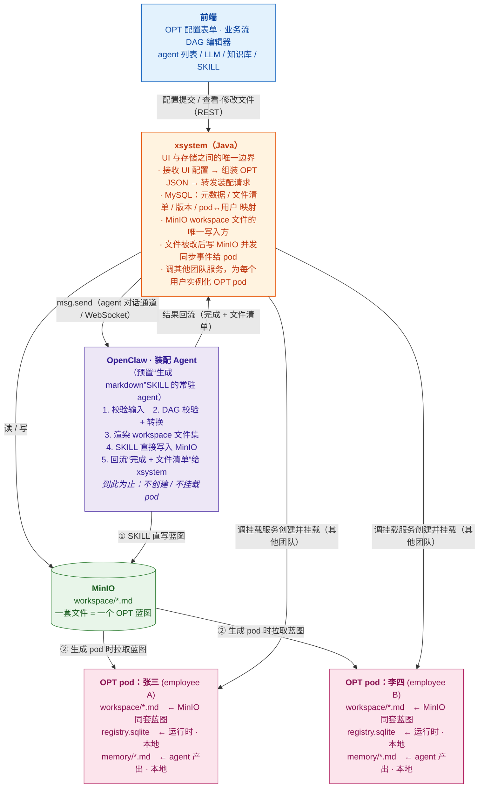

# OPT 自动装配设计文档

---

## 一、整体架构

系统由四个模块组成：


| 模块           | 职责                                                              | 技术栈   |
| ------------ | --------------------------------------------------------------- | ----- |
| **前端**       | Web 配置界面，出 OPT 配置表单、DAG 编辑器，所有读写都调 xsystem                      | Web   |
| **xsystem**  | 后端服务，UI 与存储之间的唯一边界，操作 MySQL（元数据）和 MinIO（文件）                     | Java  |
| **MinIO**    | 对象存储，存放装配 agent 生成的 workspace markdown 文件（真源 / source of truth） | S3 兼容 |
| **OpenClaw** | 内置 Assemble Agent 的运行平台，渲染文件、上传 MinIO、挂载 pod                    | —     |





**三类角色，职责分开看：**

- **装配 Agent（装配器）**：openclaw 里一个**预置了“生成 markdown”SKILL 的常驻 agent**，不是额外的 HTTP 接口、也不需要给 claw 装插件。xsystem 通过现成的 **agent 对话通道**（`AgentProtocolService` 的 `msg.send`）给它发一条带 OPT 配置的消息，它**渲染 workspace 文件并由 SKILL 直接写入 MinIO**，到此为止——不创建、不挂载 pod。
- **xsystem（编排与挂载发起方）**：拿到 MinIO 里的一套文件后，**基于这套文件为每个用户生成一个 OPT pod**——挂载这一步由 xsystem 调用其他团队的服务执行，xsystem 不自己实现挂载逻辑。pod 与用户的映射记在 MySQL。
- **OPT pod（成品实例）**：每个用户一个，各自独立的 pod 和本地盘。张三、李四各有一个，互不干扰。

### 1.1 一套文件 vs 多个 OPT 的关系

```
一次装配  ──产出──▶  一套 OPT markdown 文件（蓝图，存 MinIO）
                          │
                          │ xsystem 基于这套文件
                          ▼
            ┌─────────────┼─────────────┐
            ▼             ▼             ▼
        OPT pod:张三   OPT pod:李四   OPT pod:王五   …… 每用户一个实例
```

- **装配的产物是文件，不是 pod。** 一次装配只生成一套 markdown（一个蓝图）。
- **OPT pod 是 xsystem 基于这套文件实例化出来的。** 同一套文件可以给多个用户各自生成一个 OPT pod。
- **挂载由其他团队的服务执行**，xsystem 只是发起方（传入用户标识 + MinIO 文件位置，调对方接口）。

### 1.2 什么时候产生 OPT pod

```
① 管理员在 UI 提交 OPT 配置
   → xsystem 组装配置消息，经 msg.send 发给装配 Agent
   → 装配 Agent 渲染文件 → SKILL 直写 MinIO → 回流文件清单
   → 一套 OPT 蓝图就绪（此时还没有任何 pod）

② 需要给某用户开通 OPT 时（如新员工入职）
   → xsystem 基于 MinIO 里的蓝图 + 用户标识
   → 调其他团队的挂载服务 → 创建并挂载该用户的 OPT pod
   → 该用户的 OPT 诞生，开始接收消息
```

装配（生成文件）和实例化（生成 pod）是**两个独立阶段**：蓝图先就绪，用户开通时再按需生成 pod。

### 1.3 OPT 生成后，修改了 markdown 怎么传回 OPT

OPT 跑起来后，操作员可在 UI 改 workspace 文件（如调 AGENTS.md）。改动**不直接写 pod**，而是先回 MinIO 真源，再同步下行到对应 OPT pod：

```
UI 改文件
  → xsystem：① 覆盖写 MinIO 对应对象  ② 更新 MySQL 文件版本
  → xsystem 向受影响的每个 OPT pod 发同步事件
         POST /plugins/webhooks/<opt-sync-route>  （Bearer secret）
         goal: "sync_workspace: optId=hr-zhang-san, files=[AGENTS.md]"
  → openclaw webhooks 插件 → 该 OPT 的 TaskFlow
  → 同步逻辑从 MinIO 拉取变更文件 → 覆盖该 pod 本地副本 → 必要时重载 agent 配置
```

关键点：

- 一套蓝图可能被实例化成多个 pod，xsystem 按 MySQL 里的映射，**向所有基于该蓝图的 OPT pod 逐个投递同步事件**。
- 每个 OPT pod 在创建时注册一条**专属同步路由**（`sessionKey` 绑定到该 pod），xsystem 按 `optId` 投递，改谁的文件只同步谁的 pod。
- 只同步 workspace 配置文件，**SQLite 和 memory 不在同步范围**，始终留 pod 本地。
- 复用 openclaw 原生 webhooks 插件（见第四章），不新建同步通道。详细链路见 6.1。

**存储职责边界（关键）：**

- **MinIO 是 workspace 配置文件的唯一真源**，只存声明式 markdown / `.lobster` 文本文件（IDENTITY.md / SOUL.md / AGENTS.md / USER.md / TOOLS.md / HEARTBEAT.md / skills/*.SKILL.md / workflows/*.lobster）。
- **写方向单一**：装配 agent 渲染 → 上传 MinIO；UI 改文件 → xsystem 写 MinIO → 触发同步 → openclaw 从 MinIO 拉到 pod 本地。pod 本地的配置文件是只读副本。
- **SQLite（TaskFlow / task 持久化）永远留在 pod 本地盘**，绝不进 MinIO。它需要 POSIX 文件锁和 `fsync`，对象存储不具备这些语义；它是运行时状态而非配置，xsystem 也不应触碰。
- **agent 运行时产出的 memory 文件（`memory/YYYY-MM-DD.md`）只留 pod 本地**，不进 MinIO，UI 不可见。装配配置走 MinIO 单向下行，运行时状态留本地，两者不混。

---

## 二、前端配置界面

### 2.1 配置项

用户在界面上为 OPT 内每个 agent 填写以下信息：


| 配置项             | 说明                         | 必填  |
| --------------- | -------------------------- | --- |
| OPT 名称          | 显示名，写入 IDENTITY.md         | ✅   |
| 服务对象（姓名 / 职位）   | 写入 USER.md                 | ✅   |
| agent 列表        | 至少一个 main agent            | ✅   |
| 每个 agent：LLM 模型 | 从平台模型列表选择                  | ✅   |
| 每个 agent：角色描述   | 写入 IDENTITY.md / AGENTS.md | ✅   |
| 每个 agent：性格描述   | 写入 SOUL.md                 | ✅   |
| 每个 agent：知识库    | 多选，生成 kb SKILL 文件          | ⬜   |
| 每个 agent：SKILL  | 多选，写入 openclaw.json        | ⬜   |
| 业务流 DAG         | 可视化编辑器，可选                  | ⬜   |
| 心跳检查项           | 周期任务列表，可选                  | ⬜   |


### 2.2 提交格式

前端把配置提交给 xsystem，由 xsystem 组装为标准 OPT JSON。这份 JSON **不是发给某个专用装配接口，而是作为一条对话消息，经现成的 agent 通道（`msg.send`）发给预置了“生成 markdown”SKILL 的装配 Agent**。OPT 配置体如下：

```json
{
  "opt": {
    "id": "hr-zhang-san",
    "name": "张三的 HR 助手",
    "owner": {
      "name": "张三",
      "role": "HR 专员",
      "timezone": "Asia/Shanghai",
      "language": "zh-CN"
    },
    "pod": { "id": "pod-cluster-a-03" },
    "agents": [
      {
        "id": "main",
        "role": "HR 助手主 agent，负责接收员工咨询并路由给专家",
        "soul": "温和、耐心、专业，遇到不确定的问题先问再答",
        "llm": { "modelId": "qwen3.5-35b" },
        "skills": ["kb-hr-policy", "ontology-hr-leave"],
        "heartbeat": [
          "检查是否有待审批的请假申请",
          "检查今日入职/离职待办"
        ],
        "dag": { ... }
      },
      {
        "id": "policy-expert",
        "role": "HR 政策专家，负责解答政策类问题",
        "soul": "严谨、引用来源、不猜测",
        "llm": { "modelId": "qwen3.5-35b" },
        "skills": ["kb-hr-policy"]
      }
    ]
  }
}
```

xsystem 调 `AgentConversationService.send(...)` 把上面这份配置（序列化后）作为 `content` 发给装配 Agent。底层 WebSocket 帧形如：

```json
{
  "type": "req",
  "id": "<frontRequestId>",
  "method": "msg.send",
  "params": {
    "conv_id": "<装配会话 id>",
    "agent_id": "opt-assembler",
    "content": "请基于以下 OPT 配置生成 workspace 文件并写入 MinIO：\n{ \"opt\": { ... } }"
  }
}
```

装配 Agent 的 SKILL 解析配置 → 渲染文件 → 直接写 MinIO → 把“完成 + 文件清单”作为 agent 回复回流给 xsystem。无需给 openclaw 安装任何插件，也不新增 `POST /api/v1/opt/assemble` 接口。

---

## 三、CLI 工具设计与权限管理

OPT 内的 agent 通过放在 SKILL 里的 CLI 工具与外部业务系统通信。CLI 是 agent 与业务系统之间的唯一边界。

权限管理贯穿"实例化 pod → 运行时 → CLI 调用"一条主线，核心是**身份与权限随 ENV 下发，agent 不感知、不传递**：

```
xsystem 实例化 OPT pod
  │ 组装一组 ENV 键值对（含 OPT Identity Token、权限、业务系统地址、secret）
  ▼
运行时管理服务（其他团队）
  │ 把每个 KV 写入 pod 的环境变量
  ▼
openclaw pod（环境变量已就绪）
  │ agent 调用 CLI（只传业务参数，不传身份）
  ▼
CLI 子进程
  │ 继承父进程环境变量 → 读取 OPENCLAW_OPT_TOKEN 等 KV
  │ 验签 + 权限校验 → allow / deny
  ▼
执行业务操作 / 拒绝
```

下面分原则、ENV 注入链路、权限粒度、CLI 规范四部分展开。

### 3.1 核心设计原则

**CLI 不信任调用方，只信任平台颁发的 token。**

agent 调用 CLI 时，平台自动注入当前 OPT 的身份 token，CLI 凭 token 向权限服务校验操作是否被允许。agent 本身不感知权限逻辑，也不传递 userId。

```
agent
  │ 调用 CLI（携带平台注入的 token）
  ▼
CLI 工具
  │ 向权限服务校验：token + 操作类型 + 资源
  ▼
权限服务
  │ 返回 allow / deny + 原因
  ▼
CLI 工具
  │ allow → 执行业务操作，返回结果
  │ deny  → 返回标准错误，不执行
  ▼
agent 收到结果
```

### 3.2 CLI 标准接口规范

所有业务系统 CLI 遵循统一规范，方便 SKILL.md 生成和 agent 调用：

```bash
# 统一格式
<system>-cli <resource> <action> [--filter <expr>] [--json]

# 示例
hr-cli leave list --status pending --json
hr-cli leave create --type annual --days 3 --start 2026-06-01 --json
order-cli refund preview --order-id ORD-001 --json
```

**输出规范：**

```json
{
  "code": 0,
  "message": "success",
  "data": { ... },
  "meta": { "total": 10, "page": 1 }
}
```

**错误规范：**

```json
{
  "code": 403,
  "message": "当前 OPT 无 hr:leave:approve 权限",
  "data": null
}
```

agent 收到 `code !== 0` 时停止操作，将 `message` 上报给用户，不重试。

### 3.6 SKILL.md 中的 CLI 描述

装配时，每个 CLI 工具对应一个 SKILL.md，告诉 agent 何时用、怎么用、权限边界是什么：

```markdown
---
name: hr-leave
description: 查询和提交请假申请
version: "1.0"
tools:
  - hr-cli
---

# HR 请假 SKILL

## 权限边界
当前 OPT 拥有：hr:leave:read, hr:leave:create
当前 OPT 没有：hr:leave:approve, hr:leave:delete
遇到需要审批权限的操作，告知用户联系 HR 管理员，不要尝试调用。

## 何时使用
- 用户查询自己的请假记录时
- 用户提交新的请假申请时

## 命令格式
\`\`\`bash
hr-cli leave list --status <pending|approved|rejected> --json
hr-cli leave create --type <annual|sick|personal> --days <n> --start <YYYY-MM-DD> --json
\`\`\`
```

权限边界直接写在 SKILL.md 里，agent 在调用前就知道自己能做什么，不会盲目尝试越权操作。

## 知识库 SKILL（kb）

用户在界面勾选的每个知识库，装配时渲染成**一个独立的 SKILL 文件**。选了 1 个知识库就生成 1 个 kb SKILL，选 N 个就生成 N 个。

```
workspace/skills/
├── kb-hr-policy/SKILL.md       ← 知识库 1
└── kb-onboarding/SKILL.md      ← 知识库 N …… 一库一文件
```


**生成靠模板渲染**：装配 SKILL 内部维护一份模板，把后台的知识库描述符填进去即可。描述符形如：

```json
{
  "kind": "kb",
  "id": "hr-policy",
  "displayName": "HR 政策库",
  "domain": "员工手册、考勤、薪酬、福利政策",
  "sampleQuestions": ["年假怎么休", "试用期多久"],
  "permission": "kb:hr-policy:read"
}
```

渲染结果（`kb-hr-policy/SKILL.md`）：

```markdown
---
name: kb-hr-policy
description: 查询「HR 政策库」——员工手册、考勤、薪酬、福利政策的事实问答
version: "1.0"
metadata: { "openclaw": { "requires": { "bins": ["kb-cli"] } } }
tools:
  - kb-cli
---

# HR 政策库检索

## 权限边界
当前 OPT 拥有：kb:hr-policy:read（只读检索）
本知识库不支持写入；遇到"修改政策"类请求，告知用户联系 HR 管理员。

## 何时使用
- 用户问 HR 政策类事实："年假怎么休"、"试用期多久"
- 需要引用权威条款作答时
- 不用于：结构化关系查询（走 ontology-* SKILL）

## 命令格式
\`\`\`bash
# 语义检索，返回 topk 片段 + 来源
kb-cli search --kb hr-policy --query "<问题>" --topk 5 --json
# 按文档 id 取全文
kb-cli get --kb hr-policy --doc-id <id> --json
\`\`\`

## 执行纪律
- 答案必须基于检索到的片段，标注来源 doc-id，不凭记忆编造
- 召回为空时如实说"未找到"，不杜撰
```


##  本体 SKILL（ontology）

用户勾选的每个本体，同样**一本体一 SKILL**，命名空间 `ontology-<id>`。选 2 个本体生成 2 个文件。

```
workspace/skills/
├── ontology-hr-leave/SKILL.md     ← 本体 1
└── ontology-org-chart/SKILL.md    ← 本体 2
```

**与知识库的本质差异**：知识库是非结构化文本的"语义召回片段"，本体是**结构化的概念 / 关系 / 属性**（实体、关系、属性三元组）。查法不同，所以 CLI 动词不同——知识库是 `search/get`，本体是 `concept get / relation list / query`。

本体描述符形如：

```json
{
  "kind": "ontology",
  "id": "hr-leave",
  "displayName": "请假本体",
  "domain": "假期类型、适用条件、审批链路的结构化关系",
  "permission": "ontology:hr-leave:read"
}
```

渲染结果（`ontology-hr-leave/SKILL.md`）：

```markdown
---
name: ontology-hr-leave
description: 查询「请假本体」——假期类型、适用条件、审批链路的结构化关系
version: "1.0"
metadata: { "openclaw": { "requires": { "bins": ["onto-cli"] } } }
tools:
  - onto-cli
---

# 请假本体查询

## 权限边界
当前 OPT 拥有：ontology:hr-leave:read（只读）
本体只读，不支持改写概念 / 关系。

## 何时使用
- 需要结构化关系："年假的审批人是谁"、"哪些假期类型适用于试用期"
- 需要概念定义和属性时
- 不用于：政策原文事实问答（走 kb-* SKILL）

## 命令格式
\`\`\`bash
onto-cli concept get   --onto hr-leave --name "年假" --json
onto-cli relation list --onto hr-leave --entity "年假" --rel "审批人" --json
onto-cli query         --onto hr-leave --expr "假期类型 where 适用=试用期" --json
\`\`\`

## 执行纪律
- 关系遍历的结论附上来源实体和关系名，不臆断未声明的关系
- 查不到对应概念 / 关系时如实说明，不编造
```


---

## 四、业务系统事件接收

业务系统状态变化（如"请假申请被审批"、"新工单创建"）需要及时推送给 OPT，触发 agent 响应。

### 4.1 使用 openclaw 原生 webhooks 插件

openclaw 内置了 **webhooks 插件**（`extensions/webhooks`），这是事件接收的正确入口。

webhooks 插件的核心模型是 **TaskFlow**：业务系统通过 webhook 推送事件，openclaw 将其转换为 TaskFlow 操作，agent 监听 TaskFlow 状态变化并响应。

```
业务系统
  │ 状态变化（请假审批通过、工单创建...）
  │ POST /plugins/webhooks/<routeId>
  │ Authorization: Bearer <webhook-secret>
  │ { "action": "create_flow", "goal": "请假审批通过，leaveId=LEAVE-2026-001", ... }
  ▼
openclaw webhooks 插件
  │ 验证 Bearer secret（timing-safe 比对）
  │ 解析 action（create_flow / resume_flow / run_task / ...）
  ▼
TaskFlow runtime
  │ 创建或更新 TaskFlow
  │ 绑定到对应 agent 的 sessionKey
  ▼
agent session 被唤醒，收到 TaskFlow goal 作为任务描述
  │ 按 AGENTS.md 中的 Standing Orders 处理
```

### 4.3 装配时的配置

装配时，Assemble Agent 在 OPT 的 `openclaw.json` 中为每个需要接收外部事件的 agent 注册 webhook 路由：

```json5
{
  "plugins": {
    "entries": {
      "webhooks": {
        "routes": {
          // 路由 id → 路由配置
          "hr-leave-events": {
            "path": "/plugins/webhooks/hr-leave-events",
            "sessionKey": "session:hr-zhang-san-main",
            // secret 从环境变量读取，不写明文
            "secret": { "source": "env", "provider": "platform", "id": "WEBHOOK_SECRET_HR_LEAVE" },
            "controllerId": "hr-leave-watcher",
            "description": "接收 HR 系统的请假审批事件"
          },
          "hr-onboarding-events": {
            "path": "/plugins/webhooks/hr-onboarding-events",
            "sessionKey": "session:hr-zhang-san-main",
            "secret": { "source": "env", "provider": "platform", "id": "WEBHOOK_SECRET_HR_ONBOARD" },
            "controllerId": "hr-onboarding-watcher",
            "description": "接收 HR 系统的入职任务事件"
          }
        }
      }
    }
  }
}
```

`sessionKey` 绑定到 OPT 内对应 agent 的 session，事件到达时该 agent 被唤醒。

### 4.4 业务系统推送格式

业务系统向 webhook 路由推送事件，使用 `create_flow` action 创建一个新的 TaskFlow，`goal` 字段描述本次事件的任务意图：

```
POST /plugins/webhooks/hr-leave-events
Authorization: Bearer <webhook-secret>
Content-Type: application/json

{
  "action": "create_flow",
  "goal": "请假审批结果通知：leaveId=LEAVE-2026-001，result=approved，approver=李四，effectiveDate=2026-06-01",
  "stateJson": {
    "leaveId": "LEAVE-2026-001",
    "result": "approved",
    "approver": "李四",
    "effectiveDate": "2026-06-01"
  }
}
```

响应示例：

```json
{
  "ok": true,
  "routeId": "hr-leave-events",
  "result": {
    "flow": {
      "flowId": "flow-abc123",
      "status": "queued",
      "goal": "请假审批结果通知：...",
      "revision": 0,
      "createdAt": 1748649600000
    }
  }
}
```

### 4.5 AGENTS.md 中的 Standing Orders 对应写法

agent 收到 TaskFlow 后，按 AGENTS.md 中声明的 Standing Orders 处理。`goal` 字段就是触发条件的描述：

```markdown
## Standing Orders

### Program: 请假审批通知

**Trigger:** 收到 TaskFlow，goal 包含"请假审批结果通知"
**Authority:** 通知员工审批结果，更新本地记录
**Approval gate:** 无，自动执行

#### 执行步骤
1. 从 TaskFlow stateJson 提取 leaveId、result、approver、effectiveDate
2. 查询 `hr-cli leave get --id <leaveId> --json` 获取完整信息
3. 向员工发送通知：审批结果 + 审批人 + 生效日期
4. 写入 `memory/YYYY-MM-DD.md`
5. 调用 finish_flow 标记 TaskFlow 完成
```

### 4.6 Webhook Secret 管理

Secret 在装配时由平台生成，通过两个渠道分发：

- **openclaw pod 侧**：注入为环境变量（与 OPT Identity Token 同一机制），`openclaw.json` 中用 `source: env` 引用，不写明文
- **业务系统侧**：平台通过安全渠道（如密钥管理服务）下发给业务系统，业务系统在推送时放入 `Authorization: Bearer` header

openclaw webhooks 插件使用 timing-safe 字符串比对验证 secret，防止时序攻击。

### 4.7 Heartbeat 作为兜底

Webhook 是主动推送，Heartbeat 是被动轮询兜底。两者配合使用：

- Webhook：实时性高，业务系统主动通知，延迟低
- Heartbeat：每 30 分钟检查一次，捕获 webhook 推送遗漏的状态变化

```markdown
# HEARTBEAT.md

## 周期检查

- [ ] 检查是否有状态为 pending 超过 2 小时的请假申请（webhook 兜底）
  - 命令：`hr-cli leave list --status pending --older-than 2h --json`
  - 处理：主动查询审批结果，通知员工当前状态
```

---

## 五、DAG 到流程文件的转换

Web 界面上的业务流 DAG 需要转换为 agent 可执行的流程描述。根据流程的确定性程度，转换为两种目标格式。

### 5.1 两种目标格式

本章用一个贯穿例子——**办事员 OPT 处理「创建公司的审核流程」**：

> 1. 企业提交材料后，触发审核
> 2. 审核各项材料是否都已上传
> 3. 逐项审核：营业资质审核 → 财务资料审核。**每项审核完成后把情况反馈给办事员，办事员确认后才进入下一项**
> 4. 联系法人做人脸识别
> 5. 材料预审通过，触发 OA 中的联审

**Standing Orders** 是写在 `AGENTS.md` 里的常驻指令块，格式是结构化的自然语言。agent 每次 session 启动时自动读入，遇到匹配的触发条件就按步骤执行。它不是代码，是给 LLM 看的"操作手册"——LLM 负责理解意图、判断材料是否合规、处理异常，执行顺序由 LLM 推理决定，而不是引擎强制保证。

```markdown
## Standing Orders

### Program: 营业资质审核

**Trigger:** 进入营业资质审核环节
**Authority:** 阅读并判断资质材料是否合规，向办事员汇报
**Approval gate:** 汇报后必须等办事员确认，才能进入下一项审核

#### 执行步骤
1. gov-cli company doc get --company-id <id> --item business-license --json
2. 对照资质要求，判断材料是否齐全、有效、一致
3. 把审核结论（通过 / 存疑点 + 理由）反馈给办事员
4. 等办事员确认，确认后再进入财务资料审核
```

与 Lobster 的核心区别：Lobster 是**引擎执行**（步骤顺序由 runtime 保证，不经过 LLM 推理）；Standing Orders 是 **LLM 执行**（步骤是给模型的提示，模型决定怎么走）。


| 场景                          | 目标格式                      | 特点                    |
| --------------------------- | ------------------------- | --------------------- |
| 步骤固定、顺序确定、"审核"=调外部服务返回结论    | Lobster 工作流（`.lobster`）   | 引擎保证顺序，确认节点暂停等办事员     |
| "审核"需要 LLM 阅读材料、判断合规性、写审查意见 | AGENTS.md Standing Orders | prompt 约束，LLM 驱动执行和判断 |


判断规则：DAG 中所有节点都是命令调用（CLI / API）+ 确认，选 Lobster；DAG 中有"判断材料是否合规""分析""总结"这类需要 LLM 推理的节点，选 Standing Orders。本流程的"逐项审核"如果是 LLM 自己读材料下判断，属于后者；如果是调一个外部审核服务拿 pass/fail，属于前者。下面两种都演示。

### 5.2 DAG JSON 格式

前端 DAG 编辑器导出标准 JSON。下面是「创建公司的审核流程」的 DAG（每项审核后接一个"反馈并等办事员确认"的 approval 节点）：

```json
{
  "id": "company-create-review",
  "name": "创建公司的审核流程",
  "nodes": [
    {
      "id": "check_uploaded",
      "type": "command",
      "label": "审核各项材料是否都已上传",
      "command": "gov-cli company doc check-uploaded --company-id $companyId --json"
    },
    {
      "id": "review_license",
      "type": "command",
      "label": "营业资质审核",
      "command": "gov-cli company review --company-id $companyId --item business-license --json",
      "input": "check_uploaded"
    },
    {
      "id": "confirm_license",
      "type": "approval",
      "label": "向办事员反馈资质审核结果并等其确认",
      "input": "review_license"
    },
    {
      "id": "review_finance",
      "type": "command",
      "label": "财务资料审核",
      "command": "gov-cli company review --company-id $companyId --item finance --json",
      "input": "review_license",
      "condition": "confirm_license.approved"
    },
    {
      "id": "confirm_finance",
      "type": "approval",
      "label": "向办事员反馈财务审核结果并等其确认",
      "input": "review_finance"
    },
    {
      "id": "face_verify",
      "type": "command",
      "label": "联系法人做人脸识别",
      "command": "gov-cli company face-verify invite --company-id $companyId --json",
      "input": "review_finance",
      "condition": "confirm_finance.approved"
    },
    {
      "id": "trigger_oa",
      "type": "command",
      "label": "材料预审通过，触发 OA 联审",
      "command": "oa-cli joint-review start --company-id $companyId --json",
      "input": "face_verify"
    }
  ]
}
```


**节点类型：**


| type         | 说明                 | 转换结果                                         |
| ------------ | ------------------ | -------------------------------------------- |
| `command`    | CLI / API 调用       | Lobster step（普通）                             |
| `approval`   | 反馈并等办事员（OPT 主人）确认  | Lobster step + `approval: required`          |
| `condition`  | 条件分支（依赖前一个确认结果）    | Lobster step + `condition: $<gate>.approved` |
| `agent-task` | 调用子 agent          | Lobster step + `command: agent-invoke`       |
| `llm-judge`  | LLM 判断（如自行阅读材料判合规） | 触发 Standing Orders 模式，不生成 Lobster            |


### 5.3 转换为 Lobster 工作流

> `dag2lobster` 是**平台需要自行实现的内部转换工具**，不是 openclaw 原生能力。它的职责是将前端 DAG JSON 转换为 Lobster `.lobster` 文件，可以实现为一个独立的 Node.js/Python 脚本，由 Assemble Agent 通过 `assemble-api` 调用。

`dag2lobster` 执行以下转换规则：

```
DAG node(type=command)   → Lobster step { id, command }
DAG node(type=approval)  → Lobster step { id, command, approval: required }
DAG node(type=condition) → Lobster step { id, command, condition: $<gate>.approved }
DAG edge(A → B)          → B.stdin = $A.stdout
DAG node(type=agent-task)→ Lobster step { command: agent-invoke --agent <id> --task <label> }
```

转换结果示例（「创建公司的审核流程」，每项审核后是等办事员确认的 `approval` 节点）：

```yaml
# workflows/company-create-review.lobster
name: company-create-review

steps:
  - id: check_uploaded
    command: agent-invoke --agent doc-checker --task "检查各项材料是否都已上传，列出缺项"

  - id: confirm_uploaded
    command: openclaw.message --channel dingtalk --text "各项材料审核结果如下，请确认是否继续"
    stdin: $check_uploaded.stdout
    approval: required

  - id: review_license
    command: agent-invoke --agent license-reviewer --task "阅读营业资质材料，判断是否齐全、有效、主体一致，给出通过/存疑结论+理由"
    stdin: $check_uploaded.stdout

  # 反馈资质审核结果，暂停等办事员（OPT 主人）确认
  - id: confirm_license
    command: openclaw.message --channel dingtalk --text "营业资质审核结果如下，请确认是否继续"
    stdin: $review_license.stdout
    approval: required

  - id: review_finance
    command: agent-invoke --agent finance-reviewer --task "阅读财务资料，判断是否齐全、真实、口径一致，给出通过/存疑结论+理由"
    stdin: $review_license.stdout
    condition: $confirm_license.approved

  - id: confirm_finance
    command: openclaw.message --channel dingtalk --text "财务资料审核结果如下，请确认是否继续"
    stdin: $review_finance.stdout
    approval: required

  - id: face_verify
    command: gov-cli company face-verify invite --company-id $companyId --json
    stdin: $review_finance.stdout
    condition: $confirm_finance.approved

  - id: trigger_oa
    command: agent-invoke --agent oa-agent --task "材料预审通过，触发 OA 联审"
    stdin: $face_verify.stdout
```

每个 `approval: required` 都是一道闸：引擎跑到这里**暂停**，把上一步的审核结论推给办事员，办事员确认（`approved`）后才放行下一项审核。两项审核串行、各带一道确认闸，顺序由引擎死保，不靠 LLM 自觉。

### 5.4 转换为 Standing Orders

当"审核"不是调外部服务拿 pass/fail，而是要 **LLM 自己阅读材料、判断是否合规、写审查意见**时，对应的 DAG 节点是 `llm-judge`，`dag2lobster` 把它输出成 Standing Orders 片段，由装配 Agent 注入到 AGENTS.md。

同一个「创建公司的审核流程」，如果两项审核都靠 LLM 研判，整条流程更适合写成 Standing Orders——因为引擎无法"判断财务资料是否合规"，这件事只有 LLM 能做。

DAG 节点（以财务审核为例）：

```json
{
  "id": "review_finance",
  "type": "llm-judge",
  "label": "财务资料审核",
  "prompt": "阅读企业上传的财务资料，判断是否齐全、真实、口径一致，给出通过 / 存疑结论和理由",
  "input": "confirm_license"
}
```

生成的 Standing Orders（注入 `AGENTS.md`）：

```markdown
## Standing Orders

### Program: 创建公司的审核流程

**Trigger:** 收到 TaskFlow，goal 包含"公司创建审核，companyId=..."
**Authority:** 阅读材料、研判合规性、向办事员汇报；不替办事员做最终放行
**Approval gate:** 每完成一项审核，必须把结论反馈给办事员并等其确认，确认后才进入下一项

#### 执行步骤

1. **检查材料齐全性**
   `gov-cli company doc check-uploaded --company-id <id> --json`
   有缺项：列出缺失材料，反馈办事员，流程暂停等补齐。

2. **营业资质审核**
   取材料 `gov-cli company doc get --company-id <id> --item business-license --json`，
   阅读并判断资质是否齐全、有效、主体一致。
   → 把结论（通过 / 存疑点 + 理由）反馈办事员，**等确认**。未确认不得继续。

3. **财务资料审核**（办事员确认上一项后）
   阅读财务资料，判断是否齐全、真实、口径一致。
   → 反馈结论，**等办事员确认**。

4. **联系法人做人脸识别**（两项均确认通过后）
   `gov-cli company face-verify invite --company-id <id> --json`，把人脸识别链接 / 状态告知办事员。

5. **触发 OA 联审**
   人脸识别通过、材料预审通过后：
   `oa-cli joint-review start --company-id <id> --json`，并向办事员回报联审已发起。

#### 纪律
- 每项审核结论必须有依据（引用具体材料字段），不臆断
- 任一环节办事员未确认，不得跳到下一项
- 审核中发现硬伤（材料造假、缺关键证照）立即停下，标注并等办事员决定
```


