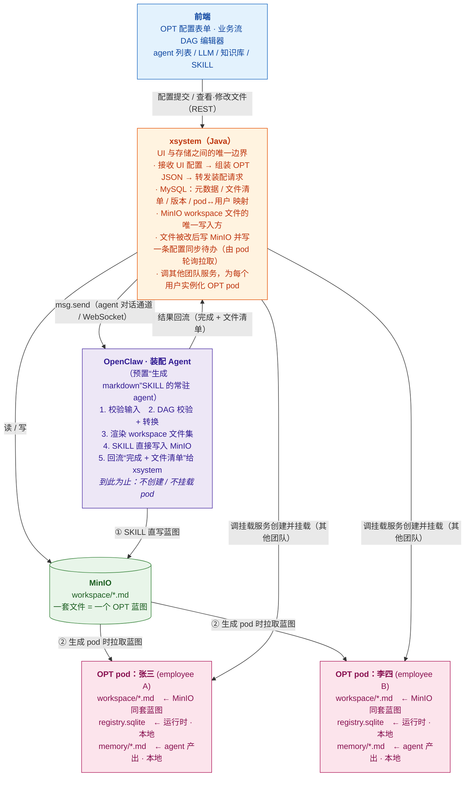

# OPT 自动装配设计文档

---

## 一、整体架构

系统由四个模块组成：


| 模块           | 职责                                                              | 技术栈   |
| ------------ | --------------------------------------------------------------- | ----- |
| **前端**       | Web 配置界面，出 OPT 配置表单、DAG 编辑器，所有读写都调 xsystem                      | Web   |
| **xsystem**  | 后端服务，UI 与存储之间的唯一边界，操作 MySQL（元数据）和 MinIO（文件）                     | Java  |
| **MinIO**    | 对象存储，存放装配 agent 生成的 workspace markdown 文件（真源 / source of truth） | S3 兼容 |
| **OpenClaw** | 内置 Assemble Agent 的运行平台，渲染文件、上传 MinIO、挂载 pod                    | —     |





**三类角色，职责分开看：**

- **装配 Agent（装配器）**：openclaw 里一个**预置了“生成 markdown”SKILL 的常驻 agent**，不是额外的 HTTP 接口、也不需要给 claw 装插件。xsystem 通过现成的 **agent 对话通道**（`AgentProtocolService` 的 `msg.send`）给它发一条带 OPT 配置的消息，它**渲染 workspace 文件并由 SKILL 直接写入 MinIO**，到此为止——不创建、不挂载 pod。
- **xsystem（编排与挂载发起方）**：拿到 MinIO 里的一套文件后，**基于这套文件为每个用户生成一个 OPT pod**——挂载这一步由 xsystem 调用其他团队的服务执行，xsystem 不自己实现挂载逻辑。pod 与用户的映射记在 MySQL。
- **OPT pod（成品实例）**：每个用户一个，各自独立的 pod 和本地盘。张三、李四各有一个，互不干扰。

### 1.1 一套文件 vs 多个 OPT 的关系

```
一次装配  ──产出──▶  一套 OPT markdown 文件（蓝图，存 MinIO）
                          │
                          │ xsystem 基于这套文件
                          ▼
            ┌─────────────┼─────────────┐
            ▼             ▼             ▼
        OPT pod:张三   OPT pod:李四   OPT pod:王五   …… 每用户一个实例
```

- **装配的产物是文件，不是 pod。** 一次装配只生成一套 markdown（一个蓝图）。
- **OPT pod 是 xsystem 基于这套文件实例化出来的。** 同一套文件可以给多个用户各自生成一个 OPT pod。
- **挂载由其他团队的服务执行**，xsystem 只是发起方（传入用户标识 + MinIO 文件位置，调对方接口）。

### 1.2 什么时候产生 OPT pod

```
① 管理员在 UI 提交 OPT 配置
   → xsystem 组装配置消息，经 msg.send 发给装配 Agent
   → 装配 Agent 渲染文件 → SKILL 直写 MinIO → 回流文件清单
   → 一套 OPT 蓝图就绪（此时还没有任何 pod）

② 需要给某用户开通 OPT 时（如新员工入职）
   → xsystem 基于 MinIO 里的蓝图 + 用户标识
   → 调其他团队的挂载服务 → 创建并挂载该用户的 OPT pod
   → 该用户的 OPT 诞生，开始接收消息
```

装配（生成文件）和实例化（生成 pod）是**两个独立阶段**：蓝图先就绪，用户开通时再按需生成 pod。

### 1.3 OPT 生成后，修改了 markdown 怎么传回 OPT

OPT 跑起来后，操作员可在 UI 改 workspace 文件（如调 AGENTS.md）。改动**不直接写 pod**，而是先回 MinIO 真源，再同步下行到对应 OPT pod。下行同样走**轮询拉取**，不向 pod 开入站端口（与第四章一致）：

```
UI 改文件
  → xsystem：① 覆盖写 MinIO 对应对象  ② 更新 MySQL 文件版本
  → xsystem 为受影响的每个 OPT pod 写一条「配置同步待办」
         todo(opt_id, event_type=workspace.sync, payload={files:[AGENTS.md], version})
  → 该 OPT 的定时任务到点拉取待办（todo-cli list）
  → 命中 workspace.sync → 从 MinIO 拉变更文件 → 覆盖本地副本 → 必要时重载 agent 配置
  → todo-cli done
```

关键点：

- 一套蓝图可能被实例化成多个 pod，xsystem 按 MySQL 里的映射，**为每个基于该蓝图的 OPT pod 各写一条同步待办**。
- 同步待办按 `opt_id` 归属，claw 凭自身 token 只拉到自己的，**改谁的文件只同步谁的 pod**。
- 只同步 workspace 配置文件，**SQLite 和 memory 不在同步范围**，始终留 pod 本地。
- 复用第四章的待办拉取通道，**不新建同步通道、不做 openclaw 定制**。详细链路见 6.1。

**存储职责边界（关键）：**

- **MinIO 是 workspace 配置文件的唯一真源**，只存声明式 markdown / `.lobster` 文本文件（IDENTITY.md / SOUL.md / AGENTS.md / USER.md / TOOLS.md / HEARTBEAT.md / skills/*.SKILL.md / workflows/*.lobster）。
- **写方向单一**：装配 agent 渲染 → 上传 MinIO；UI 改文件 → xsystem 写 MinIO → 触发同步 → openclaw 从 MinIO 拉到 pod 本地。pod 本地的配置文件是只读副本。
- **SQLite（TaskFlow / task 持久化）永远留在 pod 本地盘**，绝不进 MinIO。它需要 POSIX 文件锁和 `fsync`，对象存储不具备这些语义；它是运行时状态而非配置，xsystem 也不应触碰。
- **agent 运行时产出的 memory 文件（`memory/YYYY-MM-DD.md`）只留 pod 本地**，不进 MinIO，UI 不可见。装配配置走 MinIO 单向下行，运行时状态留本地，两者不混。

---

## 二、前端配置界面

### 2.1 配置项

用户在界面上为 OPT 内每个 agent 填写以下信息：


| 配置项             | 说明                         | 必填  |
| --------------- | -------------------------- | --- |
| OPT 名称          | 显示名，写入 IDENTITY.md         | ✅   |
| 服务对象（姓名 / 职位）   | 写入 USER.md                 | ✅   |
| agent 列表        | 至少一个 main agent            | ✅   |
| 每个 agent：LLM 模型 | 从平台模型列表选择                  | ✅   |
| 每个 agent：角色描述   | 写入 IDENTITY.md / AGENTS.md | ✅   |
| 每个 agent：性格描述   | 写入 SOUL.md                 | ✅   |
| 每个 agent：知识库    | 多选，生成 kb SKILL 文件          | ⬜   |
| 每个 agent：SKILL  | 多选，写入 openclaw.json        | ⬜   |
| 业务流 DAG         | 可视化编辑器，可选                  | ⬜   |
| 心跳检查项           | 周期任务列表，可选                  | ⬜   |


### 2.2 提交格式

前端把配置提交给 xsystem，由 xsystem 组装为标准 OPT JSON。这份 JSON **不是发给某个专用装配接口，而是作为一条对话消息，经现成的 agent 通道（`msg.send`）发给预置了“生成 markdown”SKILL 的装配 Agent**。OPT 配置体如下：

```json
{
  "opt": {
    "id": "hr-zhang-san",
    "name": "张三的 HR 助手",
    "owner": {
      "name": "张三",
      "role": "HR 专员",
      "timezone": "Asia/Shanghai",
      "language": "zh-CN"
    },
    "pod": { "id": "pod-cluster-a-03" },
    "agents": [
      {
        "id": "main",
        "role": "HR 助手主 agent，负责接收员工咨询并路由给专家",
        "soul": "温和、耐心、专业，遇到不确定的问题先问再答",
        "llm": { "modelId": "qwen3.5-35b" },
        "skills": ["kb-hr-policy", "ontology-hr-leave"],
        "heartbeat": [
          "检查是否有待审批的请假申请",
          "检查今日入职/离职待办"
        ],
        "dag": { ... }
      },
      {
        "id": "policy-expert",
        "role": "HR 政策专家，负责解答政策类问题",
        "soul": "严谨、引用来源、不猜测",
        "llm": { "modelId": "qwen3.5-35b" },
        "skills": ["kb-hr-policy"]
      }
    ]
  }
}
```

xsystem 调 `AgentConversationService.send(...)` 把上面这份配置（序列化后）作为 `content` 发给装配 Agent。底层 WebSocket 帧形如：

```json
{
  "type": "req",
  "id": "<frontRequestId>",
  "method": "msg.send",
  "params": {
    "conv_id": "<装配会话 id>",
    "agent_id": "opt-assembler",
    "content": "请基于以下 OPT 配置生成 workspace 文件并写入 MinIO：\n{ \"opt\": { ... } }"
  }
}
```

装配 Agent 的 SKILL 解析配置 → 渲染文件 → 直接写 MinIO → 把“完成 + 文件清单”作为 agent 回复回流给 xsystem。无需给 openclaw 安装任何插件，也不新增 `POST /api/v1/opt/assemble` 接口。

---

## 三、CLI 工具设计与权限管理

OPT 内的 agent 通过放在 SKILL 里的 CLI 工具与外部业务系统通信。CLI 是 agent 与业务系统之间的唯一边界。

权限管理贯穿"实例化 pod → 运行时 → CLI 调用"一条主线，核心是**身份与权限随 ENV 下发，agent 不感知、不传递**：

```
xsystem 实例化 OPT pod
  │ 组装一组 ENV 键值对（含 OPT Identity Token、权限、业务系统地址、secret）
  ▼
运行时管理服务（其他团队）
  │ 把每个 KV 写入 pod 的环境变量
  ▼
openclaw pod（环境变量已就绪）
  │ agent 调用 CLI（只传业务参数，不传身份）
  ▼
CLI 子进程
  │ 继承父进程环境变量 → 读取 OPENCLAW_OPT_TOKEN 等 KV
  │ 验签 + 权限校验 → allow / deny
  ▼
执行业务操作 / 拒绝
```

下面分原则、ENV 注入链路、权限粒度、CLI 规范四部分展开。

### 3.1 核心设计原则

**CLI 不信任调用方，只信任平台颁发的 token。**

agent 调用 CLI 时，平台自动注入当前 OPT 的身份 token，CLI 凭 token 向权限服务校验操作是否被允许。agent 本身不感知权限逻辑，也不传递 userId。

```
agent
  │ 调用 CLI（携带平台注入的 token）
  ▼
CLI 工具
  │ 向权限服务校验：token + 操作类型 + 资源
  ▼
权限服务
  │ 返回 allow / deny + 原因
  ▼
CLI 工具
  │ allow → 执行业务操作，返回结果
  │ deny  → 返回标准错误，不执行
  ▼
agent 收到结果
```

### 3.2 CLI 标准接口规范

所有业务系统 CLI 遵循统一规范，方便 SKILL.md 生成和 agent 调用：

```bash
# 统一格式
<system>-cli <resource> <action> [--filter <expr>] [--json]

# 示例
hr-cli leave list --status pending --json
hr-cli leave create --type annual --days 3 --start 2026-06-01 --json
order-cli refund preview --order-id ORD-001 --json
```

**输出规范：**

```json
{
  "code": 0,
  "message": "success",
  "data": { ... },
  "meta": { "total": 10, "page": 1 }
}
```

**错误规范：**

```json
{
  "code": 403,
  "message": "当前 OPT 无 hr:leave:approve 权限",
  "data": null
}
```

agent 收到 `code !== 0` 时停止操作，将 `message` 上报给用户，不重试。

### 3.6 SKILL.md 中的 CLI 描述

装配时，每个 CLI 工具对应一个 SKILL.md，告诉 agent 何时用、怎么用、权限边界是什么：

```markdown
---
name: hr-leave
description: 查询和提交请假申请
version: "1.0"
tools:
  - hr-cli
---

# HR 请假 SKILL

## 权限边界
当前 OPT 拥有：hr:leave:read, hr:leave:create
当前 OPT 没有：hr:leave:approve, hr:leave:delete
遇到需要审批权限的操作，告知用户联系 HR 管理员，不要尝试调用。

## 何时使用
- 用户查询自己的请假记录时
- 用户提交新的请假申请时

## 命令格式
\`\`\`bash
hr-cli leave list --status <pending|approved|rejected> --json
hr-cli leave create --type <annual|sick|personal> --days <n> --start <YYYY-MM-DD> --json
\`\`\`
```

权限边界直接写在 SKILL.md 里，agent 在调用前就知道自己能做什么，不会盲目尝试越权操作。

## 知识库 SKILL（kb）

用户在界面勾选的每个知识库，装配时渲染成**一个独立的 SKILL 文件**。选了 1 个知识库就生成 1 个 kb SKILL，选 N 个就生成 N 个。

**用户上传的参考知识文件（PDF、Word、文本等）直接放在对应 SKILL 目录下**，SKILL.md 里写清楚XX场景参考XXX文档。

```
workspace/skills/
├── kb-hr-policy/
│   ├── SKILL.md                ← 检索指令
│   └── reference/              ← 用户上传的参考文件
│       ├── 员工手册2026.pdf
│       ├── 考勤制度.docx
│       └── 薪酬政策.md
└── kb-onboarding/
    ├── SKILL.md
    └── reference/
        └── 入职流程.pdf
```

**生成靠模板渲染**：装配 SKILL 内部维护一份模板，把后台的知识库描述符填进去即可。描述符形如：

```json
{
  "kind": "kb",
  "id": "hr-policy",
  "displayName": "HR 政策库",
  "domain": "员工手册、考勤、薪酬、福利政策",
  "sampleQuestions": ["年假怎么休", "试用期多久"],
  "permission": "kb:hr-policy:read",
  "referenceFiles": ["reference/员工手册2026.pdf", "reference/考勤制度.docx", "reference/薪酬政策.md"]
}
```

渲染结果（`kb-hr-policy/SKILL.md`）：

```markdown
---
name: kb-hr-policy
description: 查询「HR 政策库」——员工手册、考勤、薪酬、福利政策的事实问答
version: "1.0"
metadata: { "openclaw": { "requires": { "bins": ["kb-cli"] } } }
tools:
  - kb-cli
---

# HR 政策库检索

## 参考文件
以下文件是本知识库的原始资料，路径相对于本 SKILL.md 所在目录：
- reference/员工手册2026.pdf
- reference/考勤制度.docx
- reference/薪酬政策.md

需要引用原文时，用 read 工具读取对应文件。

## 权限边界
当前 OPT 拥有：kb:hr-policy:read（只读检索）
本知识库不支持写入；遇到"修改政策"类请求，告知用户联系 HR 管理员。

## 何时使用
- 用户问 HR 政策类事实："年假怎么休"、"试用期多久"
- 需要引用权威条款作答时
- 不用于：结构化关系查询（走 ontology-* SKILL）

## 命令格式
\`\`\`bash
# 语义检索，返回 topk 片段 + 来源
kb-cli search --kb hr-policy --query "<问题>" --topk 5 --json
# 按文档 id 取全文
kb-cli get --kb hr-policy --doc-id <id> --json
\`\`\`

## 执行纪律
- 优先用 kb-cli 语义检索；检索结果不足时，用 read 工具直接读参考文件补充
- 答案必须基于检索片段或参考文件原文，标注来源，不凭记忆编造
- 召回为空时如实说"未找到"，不杜撰
```


##  本体 SKILL（ontology）

用户勾选的每个本体，同样**一本体一 SKILL**，命名空间 `ontology-<id>`。选 2 个本体生成 2 个文件。

```
workspace/skills/
├── ontology-hr-leave/SKILL.md     ← 本体 1
└── ontology-org-chart/SKILL.md    ← 本体 2
```

**与知识库的本质差异**：知识库是非结构化文本的"语义召回片段"，本体是**结构化的概念 / 关系 / 属性**（实体、关系、属性三元组）。查法不同，所以 CLI 动词不同——知识库是 `search/get`，本体是 `concept get / relation list / query`。

本体描述符形如：

```json
{
  "kind": "ontology",
  "id": "hr-leave",
  "displayName": "请假本体",
  "domain": "假期类型、适用条件、审批链路的结构化关系",
  "permission": "ontology:hr-leave:read"
}
```

渲染结果（`ontology-hr-leave/SKILL.md`）：

```markdown
---
name: ontology-hr-leave
description: 查询「请假本体」——假期类型、适用条件、审批链路的结构化关系
version: "1.0"
metadata: { "openclaw": { "requires": { "bins": ["onto-cli"] } } }
tools:
  - onto-cli
---

# 请假本体查询

## 权限边界
当前 OPT 拥有：ontology:hr-leave:read（只读）
本体只读，不支持改写概念 / 关系。

## 何时使用
- 需要结构化关系："年假的审批人是谁"、"哪些假期类型适用于试用期"
- 需要概念定义和属性时
- 不用于：政策原文事实问答（走 kb-* SKILL）

## 命令格式
\`\`\`bash
onto-cli concept get   --onto hr-leave --name "年假" --json
onto-cli relation list --onto hr-leave --entity "年假" --rel "审批人" --json
onto-cli query         --onto hr-leave --expr "假期类型 where 适用=试用期" --json
\`\`\`

## 执行纪律
- 关系遍历的结论附上来源实体和关系名，不臆断未声明的关系
- 查不到对应概念 / 关系时如实说明，不编造
```


---

## 四、业务系统事件接收

业务系统状态变化（如"请假审批通过""新工单创建""法人人脸识别完成"）需要让对应 OPT 感知并继续处理。

**本章不对 openclaw 做任何定制开发。** 不使用 webhooks 插件、不向 pod 开入站端口、不做 per-pod 路由注册。事件接收完全建立在两个 openclaw 原生能力之上：第三章的 **CLI** + 第六章的**定时任务**（cron job）。

> 轮询的调度载体是**定时任务**，不是 Heartbeat。Heartbeat 是固定节奏的"一刀切"轮询，所有检查项挤在同一节奏里、不能单条管理；定时任务每条独立调度、频率可各自设定、能按 `jobId` 精确增删——做业务轮询用定时任务才是正途（对比见 6.5）。每个轮询项 = 一个 `sessionTarget:"main"` 的定时任务，到点给主 session 注入一条"去拉取并处理"的系统事件。

### 4.1 核心思路：一切皆轮询，claw 用自身身份取自己的事


两条采集路径，最终都收敛为"claw 凭自身身份，通过 CLI 拉取属于自己的待处理项"：

- **路径 A：claw 直接轮询业务系统状态**——业务系统已有状态查询接口时，定时任务到点触发 agent 调 `xxx-cli ... list`，用自身 token scope 出"属于我的"变化。
- **路径 B：业务系统发事件到 xsystem → 落待办 → claw 轮询自己的待办**——业务系统只有事件、没有便于轮询的状态接口，或需要事件驱动时，事件先进 xsystem 的**待办任务表**，claw 再用 `todo-cli` 拉取属于自己的待办。


### 4.2 路径 A：claw 直接轮询业务系统状态

业务系统提供状态查询接口时，这是最简单的路径——**不需要 xsystem 参与，不需要待办表**。装配时为每个轮询项建一个定时任务（第六章），到点向主 session 注入"去查我的变化"的指令，agent 调 CLI 拉取属于自己的数据。

```json5
// cron/jobs.json —— 一个轮询项一条定时任务，各自独立频率
[
  {
    "id": "poll-leave-result",
    "schedule": { "kind": "every", "everyMs": 300000 },   // 每 5 分钟
    "sessionTarget": "main", "agentId": "main",
    "payload": { "kind": "systemEvent",
      "text": "检查待我处理的请假审批结果：hr-cli leave list --status approved --since-last-check --json；对每条新结果通知员工并写入 memory" }
  },
  {
    "id": "poll-new-tickets",
    "schedule": { "kind": "cron", "expr": "*/2 9-18 * * 1-5", "tz": "Asia/Shanghai" }, // 工作时段每 2 分钟
    "sessionTarget": "main", "agentId": "main",
    "payload": { "kind": "systemEvent",
      "text": "检查今日新分配给我的工单：order-cli ticket list --assignee me --status new --json；按 Standing Orders 受理" }
  }
]
```

关键点：

- `--assignee me` / `--since-last-check` 这类过滤由 **CLI 凭 OPT token 自动 scope**（第三章），agent 不传 userId，业务系统只返回"属于这个 OPT 的"数据。
- 每个轮询项**独立调度**：请假结果 5 分钟一次、工单只在工作时段查——这正是 Heartbeat 做不到、定时任务才有的精度。
- 全程 openclaw 原生 cron 系统，**无任何定制开发**。增删某个轮询项就是增删一条 job（见 6.3）。

### 4.3 路径 B：业务系统发事件到 xsystem，落待办，claw 轮询待办

业务系统没有便于轮询的状态接口，或事件具有"一次性、过后即逝"的性质（如"审批刚刚通过"这个动作本身）时，走路径 B。

事件先由业务系统 POST 给 **xsystem**，xsystem 把它转成一条**待办任务**写入待办表，并在写入时确定归属（`subject → opt`）。claw 不接收推送，而是通过 `todo-cli` **轮询自己的待办**——同样是"claw 凭自身身份来取属于自己的事"。

```
① 业务系统 → xsystem        POST /api/v1/events
   { eventType, subject, payload, idempotencyKey, resumeRef? }
        │
        ▼
② xsystem 落待办              按 subject 查 pod↔用户映射（MySQL，本来就有）
   todo(opt_id, status=pending, payload, resume_ref)
        │
        ▼
③ claw 定时任务到点触发     todo-cli list --status pending --json
   （凭 OPT token，只拉到 opt_id = 自己的待办）
        │
        ▼
④ claw 处理 → 回写状态        todo-cli done --id <todoId> --json
```

为什么这样就解决了"xsystem 不知道通知哪个 claw"：xsystem **不需要主动找到并连接 claw**，它只需在落待办时把事件归到正确的 `opt_id`（用它本来就维护的 `subject→用户→pod` 映射，见架构图第 22 行）。投递动作由 claw 反向发起，xsystem 只是一个被 claw 轮询的待办队列。

### 4.4 业务系统 → xsystem 的事件格式与待办落库

业务系统向 xsystem 推送事件（xsystem 已是 UI 与存储的唯一边界，新增一个事件入口不引入新组件）：

```
POST /api/v1/events
Authorization: Bearer <业务系统↔xsystem 的服务凭证>
Content-Type: application/json

{
  "eventType": "hr.leave.approved",
  "subject": { "type": "employee", "id": "zhang-san" },
  "idempotencyKey": "LEAVE-2026-001:approved",
  "occurredAt": "2026-06-01T10:00:00Z",
  "payload": { "leaveId": "LEAVE-2026-001", "result": "approved", "approver": "李四" },
  "resumeRef": { "flowId": "flow-abc123", "step": "wait-approval" }
}
```

字段职责：

- `subject`：业务主体标识，xsystem 用它查 `subject→用户→pod` 映射，定位 `opt_id`。业务系统只说自己的领域语言，**不需要知道 optId / podId / claw**。
- `idempotencyKey`：去重键，同一事件重复推送只落一条待办。
- `resumeRef`（可选，**本设计的关键**）：当该事件是要**接回一个进行中的业务流程**时，带上原流程的引用（如 `flowId` + 暂停在哪一步）。详见 4.5。

xsystem 收到后：

1. 校验服务凭证 + 幂等键去重。
2. 按 `subject` 查映射得到 `opt_id`；查不到（用户未开通 OPT）则入死信缓冲，不静默丢弃。
3. 写入待办表，状态 `pending`。

```sql
todo(
  todo_id        PK,
  opt_id         NOT NULL,   -- 归属：决定哪个 claw 能拉到
  event_type,
  subject_id,
  payload        JSON,
  resume_ref     JSON,       -- 接回业务流程用，可空
  status         ENUM('pending','processing','done','failed'),
  idempotency_key UNIQUE,
  created_at, updated_at
)
```

### 4.5 待办承载"恢复到业务处理流程"：resumeRef 机制

很多事件不是"凭空开始一件新事"，而是"一个**进行中的流程在等这个事件**才能往下走"。典型如第五章的公司创建审核：claw 联系法人做人脸识别后，流程**暂停**，等业务系统回传"人脸识别完成"，才能继续到"触发 OA 联审"。

这种"接回原流程"的能力由 `resumeRef` 承载，全程不需要 openclaw 定制：

```
claw 执行到需要等待的步骤
  │ 调 CLI 把"我在等什么"登记给业务系统，并暂停本流程
  │   order-cli flow suspend --flow-id flow-abc123 --step wait-approval --json
  ▼
（时间流逝，业务系统侧事件发生）
  │
业务系统事件 → xsystem  事件带上 resumeRef={flowId, step}
  ▼
xsystem 落待办          待办的 resume_ref 字段保存该引用
  ▼
claw 定时任务拉到待办      todo-cli list --status pending --json
  │ 看到 resume_ref → 知道这是"接回 flow-abc123 的 wait-approval 步"
  │ 读取该流程的暂存状态，从暂停点继续
  ▼
继续执行后续步骤 → 完成 → todo-cli done --id <todoId>
```

claw 怎么"从暂停点继续"，取决于流程的载体：

- **Lobster 工作流**（第五章 5.3）：流程状态由 Lobster runtime 持久化在 pod 本地 SQLite。`resumeRef.flowId` 对应一个挂起的 Lobster flow，claw 用 `resume_flow`（openclaw 原生 TaskFlow 能力，非定制）把它从暂停节点唤醒继续。
- **Standing Orders**（第五章 5.4）：流程是 LLM 驱动的自然语言手册。`resumeRef` 连同 `payload` 一起作为待办内容交给 agent，agent 读取 memory 里该流程的进度笔记，判断接到哪一步继续。

> 要点：待办表里的 `resume_ref` 是"事件"与"进行中流程"之间的接线。xsystem 只负责原样转存这个引用，不理解流程语义；如何接回由 claw 自己完成。

### 4.6 todo-cli：claw 拉取与回写待办的 CLI

待办的拉取和状态回写复用第三章的 CLI 机制，新增一个 `todo-cli`，凭 OPT token 自动 scope 到本 OPT 的待办：

```bash
# 拉取属于本 OPT 的待办（token 决定 opt_id，agent 不传）
todo-cli list --status pending --json

# 认领（pending → processing，防止重复处理）
todo-cli claim --id <todoId> --json

# 处理完成
todo-cli done --id <todoId> --json

# 处理失败，回到 pending 由下次轮询任务重试，超过阈值转 failed
todo-cli fail --id <todoId> --reason "<原因>" --json
```

装配时建一条定时任务拉取待办即可，无需任何插件或入站路由：

```json5
// cron/jobs.json
{
  "id": "poll-todo",
  "schedule": { "kind": "every", "everyMs": 120000 },   // 每 2 分钟
  "sessionTarget": "main", "agentId": "main",
  "payload": { "kind": "systemEvent",
    "text": "拉取并处理我的业务待办：todo-cli list --status pending --json；对每条 claim → 按 event_type / resume_ref 处理 → done" }
}
```

### 4.7 AGENTS.md 中的 Standing Orders 对应写法

claw 从待办拉到一条记录后，按 `AGENTS.md` 里声明的 Standing Orders 处理。触发条件按待办的 `event_type` 匹配：

```markdown
## Standing Orders

### Program: 请假审批通知

**Trigger:** 待办 event_type = hr.leave.approved
**Authority:** 通知员工审批结果，更新本地记录
**Approval gate:** 无，自动执行

#### 执行步骤
1. todo-cli claim --id <todoId> --json
2. 从待办 payload 提取 leaveId、result、approver
3. 如需完整信息：hr-cli leave get --id <leaveId> --json
4. 向员工发送通知：审批结果 + 审批人
5. 写入 memory/YYYY-MM-DD.md
6. todo-cli done --id <todoId> --json

### Program: 接回人脸识别后的公司审核流程

**Trigger:** 待办 event_type = gov.face.verified 且带 resume_ref
**Authority:** 从暂停点恢复审核流程并继续
**Approval gate:** 按原流程定义

#### 执行步骤
1. todo-cli claim --id <todoId> --json
2. 读取 resume_ref={flowId, step}，定位进行中的审核流程
3. resume_flow 唤醒该 flow（Lobster）或读 memory 进度续跑（Standing Orders）
4. 从"人脸识别完成"步继续：触发 OA 联审
5. todo-cli done --id <todoId> --json
```

### 4.8 两条路径如何选 + 边界情况

**选路径**：业务系统有现成的状态查询接口、分钟级延迟可接受 → 路径 A（最简，无 xsystem 参与）；事件一次性/过后即逝，或要接回进行中的流程 → 路径 B（走 xsystem 待办 + resumeRef）。两者可在同一 OPT 并存。

**服务凭证管理**：业务系统 → xsystem 的 `POST /api/v1/events` 用服务间凭证鉴权，与 webhook 明文 secret 无关；claw → CLI 的身份仍走第三章的 OPT token 随 ENV 注入。事件管道里不流转 pod 级别的明文密钥。

**边界情况**：

- **无匹配 OPT**（用户未开通 pod）：事件入死信缓冲，开通后回灌或人工介入，不静默丢弃。
- **幂等**：`idempotency_key` 唯一约束，重复事件只落一条待办。
- **并发认领**：`claim` 做 `pending→processing` 的 CAS，防多 agent / 多次轮询重复处理。
- **处理失败**：`fail` 回到 `pending` 由下次轮询任务重试，超过阈值转 `failed` 告警。
- **延迟**：实时性受轮询任务的调度间隔约束（如 1–5 分钟）。需要更低延迟时缩短间隔；秒级场景本设计不适用（那才需要推送，但会重新引入路由难题与定制开发，不在本设计取舍范围内）。
- **待办生命周期**：`done` 后归档，OPT 下线时清理其待办，避免孤儿数据。

---

## 五、DAG 到流程文件的转换

Web 界面上的业务流 DAG 需要转换为 agent 可执行的流程描述。根据流程的确定性程度，转换为两种目标格式。

### 5.1 两种目标格式

本章用一个贯穿例子——**办事员 OPT 处理「创建公司的审核流程」**：

> 1. 企业提交材料后，触发审核
> 2. 审核各项材料是否都已上传
> 3. 逐项审核：营业资质审核 → 财务资料审核。**每项审核完成后把情况反馈给办事员，办事员确认后才进入下一项**
> 4. 联系法人做人脸识别
> 5. 材料预审通过，触发 OA 中的联审

**Standing Orders** 是写在 `AGENTS.md` 里的常驻指令块，格式是结构化的自然语言。agent 每次 session 启动时自动读入，遇到匹配的触发条件就按步骤执行。它不是代码，是给 LLM 看的"操作手册"——LLM 负责理解意图、判断材料是否合规、处理异常，执行顺序由 LLM 推理决定，而不是引擎强制保证。

```markdown
## Standing Orders

### Program: 营业资质审核

**Trigger:** 进入营业资质审核环节
**Authority:** 阅读并判断资质材料是否合规，向办事员汇报
**Approval gate:** 汇报后必须等办事员确认，才能进入下一项审核

#### 执行步骤
1. gov-cli company doc get --company-id <id> --item business-license --json
2. 对照资质要求，判断材料是否齐全、有效、一致
3. 把审核结论（通过 / 存疑点 + 理由）反馈给办事员
4. 等办事员确认，确认后再进入财务资料审核
```

与 Lobster 的核心区别：Lobster 是**引擎执行**（步骤顺序由 runtime 保证，不经过 LLM 推理）；Standing Orders 是 **LLM 执行**（步骤是给模型的提示，模型决定怎么走）。


| 场景                          | 目标格式                      | 特点                    |
| --------------------------- | ------------------------- | --------------------- |
| 步骤固定、顺序确定、"审核"=调外部服务返回结论    | Lobster 工作流（`.lobster`）   | 引擎保证顺序，确认节点暂停等办事员     |
| "审核"需要 LLM 阅读材料、判断合规性、写审查意见 | AGENTS.md Standing Orders | prompt 约束，LLM 驱动执行和判断 |


判断规则：DAG 中所有节点都是命令调用（CLI / API）+ 确认，选 Lobster；DAG 中有"判断材料是否合规""分析""总结"这类需要 LLM 推理的节点，选 Standing Orders。本流程的"逐项审核"如果是 LLM 自己读材料下判断，属于后者；如果是调一个外部审核服务拿 pass/fail，属于前者。下面两种都演示。

### 5.2 DAG JSON 格式

前端 DAG 编辑器导出标准 JSON。下面是「创建公司的审核流程」的 DAG（每项审核后接一个"反馈并等办事员确认"的 approval 节点）：

```json
{
  "id": "company-create-review",
  "name": "创建公司的审核流程",
  "nodes": [
    {
      "id": "check_uploaded",
      "type": "command",
      "label": "审核各项材料是否都已上传",
      "command": "gov-cli company doc check-uploaded --company-id $companyId --json"
    },
    {
      "id": "review_license",
      "type": "command",
      "label": "营业资质审核",
      "command": "gov-cli company review --company-id $companyId --item business-license --json",
      "input": "check_uploaded"
    },
    {
      "id": "confirm_license",
      "type": "approval",
      "label": "向办事员反馈资质审核结果并等其确认",
      "input": "review_license"
    },
    {
      "id": "review_finance",
      "type": "command",
      "label": "财务资料审核",
      "command": "gov-cli company review --company-id $companyId --item finance --json",
      "input": "review_license",
      "condition": "confirm_license.approved"
    },
    {
      "id": "confirm_finance",
      "type": "approval",
      "label": "向办事员反馈财务审核结果并等其确认",
      "input": "review_finance"
    },
    {
      "id": "face_verify",
      "type": "command",
      "label": "联系法人做人脸识别",
      "command": "gov-cli company face-verify invite --company-id $companyId --json",
      "input": "review_finance",
      "condition": "confirm_finance.approved"
    },
    {
      "id": "trigger_oa",
      "type": "command",
      "label": "材料预审通过，触发 OA 联审",
      "command": "oa-cli joint-review start --company-id $companyId --json",
      "input": "face_verify"
    }
  ]
}
```


**节点类型：**


| type         | 说明                 | 转换结果                                         |
| ------------ | ------------------ | -------------------------------------------- |
| `command`    | CLI / API 调用       | Lobster step（普通）                             |
| `approval`   | 反馈并等办事员（OPT 主人）确认  | Lobster step + `approval: required`          |
| `condition`  | 条件分支（依赖前一个确认结果）    | Lobster step + `condition: $<gate>.approved` |
| `agent-task` | 调用子 agent          | Lobster step + `command: agent-invoke`       |
| `llm-judge`  | LLM 判断（如自行阅读材料判合规） | 触发 Standing Orders 模式，不生成 Lobster            |


### 5.3 转换为 Lobster 工作流

> `dag2lobster` 是**平台需要自行实现的内部转换工具**，不是 openclaw 原生能力。它的职责是将前端 DAG JSON 转换为 Lobster `.lobster` 文件，可以实现为一个独立的 Node.js/Python 脚本，由 Assemble Agent 通过 `assemble-api` 调用。

`dag2lobster` 执行以下转换规则：

```
DAG node(type=command)   → Lobster step { id, command }
DAG node(type=approval)  → Lobster step { id, command, approval: required }
DAG node(type=condition) → Lobster step { id, command, condition: $<gate>.approved }
DAG edge(A → B)          → B.stdin = $A.stdout
DAG node(type=agent-task)→ Lobster step { command: agent-invoke --agent <id> --task <label> }
```

转换结果示例（「创建公司的审核流程」，每项审核后是等办事员确认的 `approval` 节点）：

```yaml
# workflows/company-create-review.lobster
name: company-create-review

steps:
  - id: check_uploaded
    command: agent-invoke --agent doc-checker --task "检查各项材料是否都已上传，列出缺项"

  - id: confirm_uploaded
    command: openclaw.message --channel dingtalk --text "各项材料审核结果如下，请确认是否继续"
    stdin: $check_uploaded.stdout
    approval: required

  - id: review_license
    command: agent-invoke --agent license-reviewer --task "阅读营业资质材料，判断是否齐全、有效、主体一致，给出通过/存疑结论+理由"
    stdin: $check_uploaded.stdout

  # 反馈资质审核结果，暂停等办事员（OPT 主人）确认
  - id: confirm_license
    command: openclaw.message --channel dingtalk --text "营业资质审核结果如下，请确认是否继续"
    stdin: $review_license.stdout
    approval: required

  - id: review_finance
    command: agent-invoke --agent finance-reviewer --task "阅读财务资料，判断是否齐全、真实、口径一致，给出通过/存疑结论+理由"
    stdin: $review_license.stdout
    condition: $confirm_license.approved

  - id: confirm_finance
    command: openclaw.message --channel dingtalk --text "财务资料审核结果如下，请确认是否继续"
    stdin: $review_finance.stdout
    approval: required

  - id: face_verify
    command: gov-cli company face-verify invite --company-id $companyId --json
    stdin: $review_finance.stdout
    condition: $confirm_finance.approved

  - id: trigger_oa
    command: agent-invoke --agent oa-agent --task "材料预审通过，触发 OA 联审"
    stdin: $face_verify.stdout
```

每个 `approval: required` 都是一道闸：引擎跑到这里**暂停**，把上一步的审核结论推给办事员，办事员确认（`approved`）后才放行下一项审核。两项审核串行、各带一道确认闸，顺序由引擎死保，不靠 LLM 自觉。

### 5.4 转换为 Standing Orders

当"审核"不是调外部服务拿 pass/fail，而是要 **LLM 自己阅读材料、判断是否合规、写审查意见**时，对应的 DAG 节点是 `llm-judge`，`dag2lobster` 把它输出成 Standing Orders 片段，由装配 Agent 注入到 AGENTS.md。

同一个「创建公司的审核流程」，如果两项审核都靠 LLM 研判，整条流程更适合写成 Standing Orders——因为引擎无法"判断财务资料是否合规"，这件事只有 LLM 能做。

DAG 节点（以财务审核为例）：

```json
{
  "id": "review_finance",
  "type": "llm-judge",
  "label": "财务资料审核",
  "prompt": "阅读企业上传的财务资料，判断是否齐全、真实、口径一致，给出通过 / 存疑结论和理由",
  "input": "confirm_license"
}
```

生成的 Standing Orders（注入 `AGENTS.md`）：

```markdown
## Standing Orders

### Program: 创建公司的审核流程

**Trigger:** 待办 event_type = gov.company.review.start（含 companyId）；或人脸识别完成后的 event_type = gov.face.verified（含 resume_ref，从第 5 步继续）
**Authority:** 阅读材料、研判合规性、向办事员汇报；不替办事员做最终放行
**Approval gate:** 每完成一项审核，必须把结论反馈给办事员并等其确认，确认后才进入下一项

#### 执行步骤

1. **检查材料齐全性**
   `gov-cli company doc check-uploaded --company-id <id> --json`
   有缺项：列出缺失材料，反馈办事员，流程暂停等补齐。

2. **营业资质审核**
   取材料 `gov-cli company doc get --company-id <id> --item business-license --json`，
   阅读并判断资质是否齐全、有效、主体一致。
   → 把结论（通过 / 存疑点 + 理由）反馈办事员，**等确认**。未确认不得继续。

3. **财务资料审核**（办事员确认上一项后）
   阅读财务资料，判断是否齐全、真实、口径一致。
   → 反馈结论，**等办事员确认**。

4. **联系法人做人脸识别**（两项均确认通过后）
   `gov-cli company face-verify invite --company-id <id> --json`，把人脸识别链接 / 状态告知办事员。
   → 登记等待并暂停流程：`gov-cli flow suspend --company-id <id> --step wait-face-verify --json`。
   人脸识别完成后，业务系统发事件到 xsystem，落成带 resume_ref 的待办，下次轮询任务拉回本流程从第 5 步继续（见 4.5）。

5. **触发 OA 联审**（接回 gov.face.verified 待办后）
   人脸识别通过、材料预审通过后：
   `oa-cli joint-review start --company-id <id> --json`，并向办事员回报联审已发起。

#### 纪律
- 每项审核结论必须有依据（引用具体材料字段），不臆断
- 任一环节办事员未确认，不得跳到下一项
- 审核中发现硬伤（材料造假、缺关键证照）立即停下，标注并等办事员决定
```

---

## 六、定时任务管理

OPT 的周期性工作（"每天 9 点汇总昨日联审进度"）由 openclaw 内置 **cron 调度系统**（`src/cron/`）承载。

### 6.1 定时任务是什么

一个定时任务 = 一个 **cron job**：调度模式 + 触发后做什么。三种调度模式（`src/cron/types.ts`）：

| 模式 | 形态 | 用途 |
|------|------|------|
| `at` | `{ kind:"at", at:"2026-06-10T09:00:00+08:00" }` | 一次性，触发后自动删除 |
| `every` | `{ kind:"every", everyMs:1800000 }` | 固定间隔（每 30 分钟） |
| `cron` | `{ kind:"cron", expr:"0 9 * * *", tz:"Asia/Shanghai" }` | Cron 表达式（每天 9 点） |

触发后做什么由 `sessionTarget` 决定：`main` = 给主 session 注入系统事件唤醒 agent（最常用，等于"到点给自己发条消息"）；`isolated` = 起独立 agent 执行，不污染主 session。

```json5
{
  "id": "daily-digest", "schedule": { "kind":"cron", "expr":"0 9 * * *", "tz":"Asia/Shanghai" },
  "sessionTarget": "main", "agentId": "main",
  "payload": { "kind":"systemEvent", "text":"汇总昨日联审进度，生成简报并通知办事员" }
}
```

> job 定义不写在 `openclaw.json`（它只管全局参数：并发数、失败告警等），而存独立的 **`cron/jobs.json`**。

### 6.2 存储边界

openclaw 用双文件持久化（`src/cron/store.ts`），对应第一章"配置进 MinIO、运行时状态留本地"：

| 文件 | 内容 | 归属 |
|------|------|------|
| `cron/jobs.json` | 任务配置（schedule/payload/sessionTarget） | 进 MinIO 蓝图，UI 可改 |
| `cron/jobs-state.json` | 运行状态（下次触发/上次结果/错误数） | 留 pod 本地，不进 MinIO |

增删查都走 xsystem，把 `cron/jobs.json` 当普通 workspace 文件操作——**复用 6.1「改文件 → 写 MinIO → 同步 pod」机制**，不另起通道：

```
UI 增/删 → xsystem 改 MinIO 的 jobs.json + 更新 MySQL 清单 → 同步事件 → pod 重载 cron
```

### 6.3 新增 / 删除

- **新增**：xsystem 校验（cron 表达式可解析、`agentId` 在 OPT 内存在、`at` 时间在未来）→ 分配 id 追加进 `jobs.json` → 写 MinIO + MySQL → 同步 pod。整点表达式 openclaw 自动加 stagger 错峰。
- **删除**：按 `jobId` 从 `jobs.json` 移除 → 写 MinIO + MySQL → 同步 pod。`at` 任务触发后自动删除；删除不中断正在执行的那次，只取消后续调度。

### 6.4 查看列表

两种数据源按需取：

- **常规**：查 MySQL 清单（任务定义：id/调度/目标 agent/描述），快、不依赖 pod 在线。
- **要运行态**（下次触发、上次成败、错误数）：这些在 `jobs-state.json`、只在 pod 本地、不进 MinIO，需经对话通道 / 管理接口当场向 pod 拉取再合并返回。

### 6.5 与 Heartbeat 的关系

业务轮询（第四章）已统一用定时任务承载，Heartbeat 不再做业务轮询。两者定位区分：

| | Heartbeat | 定时任务（本章） |
|---|---|---|
| 触发 | 固定节奏的一刀切轮询 | 精确调度（at/every/cron），每条独立频率 |
| 载体 | `HEARTBEAT.md`（自然语言） | `cron/jobs.json`（结构化 job） |
| 管理 | 改整个文件，无法单条增删 | 按 `jobId` 精确增删 |
| 用途 | agent 自身保活 / 兜底巡检 | 业务轮询、定点报表、按时提醒（**推荐**） |

**凡是"按时去做某件业务事"——尤其是轮询业务系统状态 / 拉待办——一律用定时任务**，因为能为不同业务设不同频率、能单条增删管理。Heartbeat 只留给与具体业务无关的 agent 保活类场景。`main` 类定时任务底层也借 heartbeat runner 唤醒主 session 注入系统事件，但调度精度和单条可管理性来自 cron 系统。

---

## 七、MCP 接入

OPT 里的 agent 除了用第三章的 CLI 与业务系统通信，还可以接入 **MCP（Model Context Protocol）server**，把外部工具（如 context7、企业内部的工具服务）直接挂进 agent 的工具列表。

**接入方式：纯 JSON 配置，不改代码、不做 openclaw 定制。** 和 cron 一样，MCP 配置写在 OPT 的 `openclaw.json` 里（`mcp.servers` 字段），openclaw 启动时作为 MCP 客户端连上这些 server，把它们的工具物化为 agent 可调用的工具（实现见 `src/agents/mcp-*.ts`）。

### 7.1 配置结构

`openclaw.json` 的 `mcp` 块：`servers` 是一个以"server 名"为 key 的对象，`sessionIdleTtlMs` 是全局的 MCP 会话闲置超时。

```json5
{
  "mcp": {
    "servers": {
      // —— stdio 传输：openclaw 拉起一个本地子进程，走 stdin/stdout 通信 ——
      "context7": {
        "command": "uvx",
        "args": ["context7-mcp"],
        "env": { "SOME_TOKEN": "..." },   // 可选，注入子进程环境变量
        "cwd": "/opt/mcp"                  // 可选，子进程工作目录
      },

      // —— streamable-http 传输：连远程 HTTP MCP server ——
      "company-tools": {
        "type": "http",                    // 别名，等价于 transport: "streamable-http"
        "url": "https://mcp.example.com/mcp",
        "headers": { "Authorization": "Bearer ${MCP_TOKEN}" },
        "connectionTimeoutMs": 30000       // 可选，默认 30000
      },

      // —— sse 传输：连远程 SSE MCP server ——
      "legacy-sse": {
        "transport": "sse",
        "url": "https://sse.example.com/sse"
      }
    },
    "sessionIdleTtlMs": 300000             // MCP 会话闲置超时（ms），到期回收连接
  }
}
```

字段说明（取自 `mcp-transport-config.ts` / `mcp-config-normalize.ts`）：

| 字段 | 适用传输 | 说明 |
|------|---------|------|
| `command` | stdio | 子进程可执行命令；**出现 `command` 即判定为 stdio** |
| `args` | stdio | 命令参数数组，可选 |
| `env` | stdio | 注入子进程的环境变量；出于启动安全，部分敏感 key 会被过滤并告警 |
| `cwd` | stdio | 子进程工作目录，可选 |
| `url` | http/sse | 远程 server 地址 |
| `headers` | http/sse | 请求头（放鉴权 token 等），可选 |
| `transport` | http/sse | `"streamable-http"` 或 `"sse"` |
| `type` | 通用别名 | `"http"`→streamable-http、`"sse"`、`"streamable-http"`、`"stdio"`；与 `transport` 二选一 |
| `connectionTimeoutMs` | 通用 | 连接超时，缺省 30000 |

传输判定顺序：有 `command` → stdio；否则看 `type`/`transport` 选 streamable-http 或 sse；都不匹配则跳过该 server 并打 warn 日志。

### 7.2 装配与下发：复用配置同步机制

MCP server 是 OPT 蓝图的一部分，由 Assemble Agent 在装配时按前端选择渲染进 `openclaw.json`，随蓝图一起进 MinIO。运行后若要增删 MCP，与改 cron / 改 workspace 文件**走同一条链路**（见 1.3 / 6.1），不另起通道：

```
UI 增/删 MCP server
  → xsystem 改 MinIO 里 openclaw.json 的 mcp.servers + 更新 MySQL 版本
  → 写一条配置同步待办（workspace.sync, files=[openclaw.json]）
  → 该 OPT 的 Heartbeat 拉到待办 → 从 MinIO 拉取 → 覆盖本地 → 重载 agent 配置
  → todo-cli done
```

### 7.3 与 CLI 的分工

- **CLI（第三章）**：与企业业务系统通信的唯一边界，身份/权限随 ENV 下发，agent 不感知凭证——适合"受控的业务动作 + 权限隔离"。
- **MCP**：接入通用工具生态（文档检索、第三方工具服务等），agent 直接获得工具，配置即接入——适合"无需走业务权限边界的能力扩展"。

涉及业务系统鉴权、租户隔离的能力优先走 CLI；通用、无敏感权限的能力走 MCP。两者可在同一 OPT 并存。

> 安全提示：MCP 的 `headers`、`env` 里若含 token，应通过 ENV 占位（如 `${MCP_TOKEN}`）注入，遵循第三章"secret 随 ENV 下发、不写明文进蓝图"的原则，避免明文落入 MinIO。

---

## 八、沙箱（Sandbox）

OPT 里的 agent 会执行命令、跑代码、操作文件（`exec` / `write` / `apply_patch` 等工具）。沙箱把这些动作关进一个隔离的运行环境，**让 agent 的代码执行不碰宿主系统**。openclaw 的沙箱实现见 `src/agents/sandbox/`，同样是**纯 JSON 配置**（`openclaw.json` 的 `agents.defaults.sandbox` / 单 agent 的 `sandbox`），不需要定制开发。

### 8.1 哪些场景需要沙箱

判断依据是"这个 agent 会不会执行不可控的代码/命令"：

| 场景 | 是否需要沙箱 | 说明 |
|------|------------|------|
| agent 只调第三章的业务 CLI、查知识库、走 Standing Orders | **可不开** | CLI 本身在权限服务后面，agent 不直接碰宿主 shell |
| agent 要跑用户/LLM 生成的代码、执行 `exec` 命令 | **需要** | 生成的命令不可预测，必须隔离 |
| 处理外部上传的文件（解压、转换、解析） | **需要** | 文件内容不可信，可能触发恶意行为 |
| 子 agent / 工作流里临时拉起的执行者 | **建议** | 用 `mode: non-main` 只隔离非主 agent |
| 需要联网抓取、浏览器自动化（人脸识别页、网页取数） | **需要 + 浏览器沙箱** | 隔离的浏览器实例，见 8.5 |
| 多租户：不同用户的 OPT 跑在同一宿主 | **需要** | 防止一个 OPT 的执行影响另一个 |

经验法则：**只要 agent 会执行非确定性的代码或命令，就开沙箱**；纯"调受控 CLI + 推理"的 agent 可以不开，靠第三章的权限边界即可。

### 8.2 三种后端（backend）

`backend` 字段选择隔离的载体：

| 后端 | 配置 | 隔离方式 | 适用 |
|------|------|---------|------|
| `docker`（默认） | `sandbox.docker` | 每个沙箱一个容器，rootfs 只读、cap 全 drop、默认无网络 | 单机部署，最常用 |
| `ssh` | `sandbox.ssh` | 在远程主机上跑命令，宿主与执行机物理隔离 | 执行机与控制面分离 |
| `browser` | `sandbox.browser` | 隔离的浏览器容器（CDP + 可选 noVNC） | 网页自动化 |

docker 后端的默认安全基线（`config.ts` 里的 resolve 逻辑）：`readOnlyRoot: true`、`network: "none"`、`capDrop: ["ALL"]`、`tmpfs: ["/tmp","/var/tmp","/run"]`、工作目录 `/workspace`。也就是说**默认就是最小权限**，要放开（联网、加能力）得显式配。

### 8.3 三个核心维度：mode / scope / workspaceAccess

**mode** —— 谁被关进沙箱：

| 值 | 含义 |
|----|------|
| `off`（默认） | 不启用沙箱，agent 直接在宿主跑 |
| `non-main` | 只把非 main 的 agent（子 agent、工作流执行者）关进沙箱，main agent 在宿主 |
| `all` | 所有 agent 都进沙箱 |

**scope** —— 沙箱怎么共享（决定隔离粒度与复用）：

| 值 | 含义 |
|----|------|
| `session`（旧 `perSession: true`） | 每个会话一个独立沙箱，隔离最强 |
| `agent`（默认） | 每个 agent 一个沙箱，会话间复用 |
| `shared` | 全局共享一个沙箱，复用最高、隔离最弱；此模式下忽略 agent 级覆盖 |

**workspaceAccess** —— 沙箱能不能看到 workspace 文件：

| 值 | 含义 |
|----|------|
| `none`（默认） | 沙箱看不到 workspace，最干净 |
| `ro` | 只读挂载 workspace，能读 SKILL/AGENTS 等但不能改 |
| `rw` | 读写挂载，agent 可改 workspace（同时会挂载只读的 skills 桥接） |

对装配场景的建议：workspace 配置文件的真源是 MinIO（第一章），沙箱里**默认 `none` 或 `ro`**，避免沙箱内进程绕过"MinIO → 同步下行"的单向写入链路去改本地配置。

### 8.4 docker 后端的资源与安全配置

`sandbox.docker` 下的常用字段（全部可选，类型见 `config/types.sandbox.ts`）：

```json5
{
  "agents": {
    "defaults": {
      "sandbox": {
        "mode": "non-main",
        "backend": "docker",
        "scope": "agent",
        "workspaceAccess": "ro",
        "docker": {
          "image": "openclaw-sandbox:bookworm-slim",  // 沙箱镜像
          "network": "none",          // none / bridge / 自定义网络；禁用 host
          "readOnlyRoot": true,       // 根文件系统只读
          "capDrop": ["ALL"],         // 丢弃 Linux 能力
          "memory": "512m",           // 内存上限
          "cpus": 1,                  // CPU 上限
          "pidsLimit": 256,           // 进程数上限
          "tmpfs": ["/tmp", "/var/tmp", "/run"],
          "binds": ["/data/projects/zhangsan:/workspace/project:rw"], // 额外挂载
          "setupCommand": "pip install -r requirements.txt"          // 创建后初始化
        },
        "prune": { "idleHours": 24, "maxAgeDays": 7 }  // 自动回收
      }
    }
  }
}
```

**运行时强制的安全校验**（`validate-sandbox-security.ts`，无法绕过，除非显式开 `dangerously*` 开关）：

- **bind 挂载黑名单**：禁止把 `/etc`、`/proc`、`/sys`、`/dev`、`/root`、Docker socket（`/run/docker.sock` 等）、以及家目录下 `.ssh`/`.aws`/`.config`/`.docker`/`.gnupg` 等凭证目录挂进沙箱。
- **挂载源必须是绝对路径**，且默认限制在 workspace / agent 工作区根下；越界需 `dangerouslyAllowExternalBindSources`。
- **保留目标保护**：不能覆盖容器内 `/workspace`、`/agent` 挂载点。
- **网络**：禁止 `network: "host"`；`container:<id>` 命名空间 join 默认禁止（需 `dangerouslyAllowContainerNamespaceJoin`）。
- **seccomp / apparmor**：禁止设为 `unconfined`（不允许关掉系统调用过滤 / MAC）。

> `dangerouslyAllow*` 三个开关是显式的"我知道我在做什么"逃生门，装配模板里**默认都不开**，确需放开时应在评审后单独处理。

### 8.5 沙箱内工具策略

沙箱不仅隔离系统，还限制 agent 在沙箱内能调哪些工具（`tool-policy.ts`），用 `tools.sandbox.tools` 配 `allow` / `deny`：

```json5
{
  "tools": {
    "sandbox": {
      "tools": {
        "allow": ["exec", "read", "write", "edit", "apply_patch"],  // 白名单
        "deny": ["browser", "cron", "gateway"]                       // 黑名单
      }
    }
  }
}
```

要点：

- 不配时有内置默认：默认放行 `exec`/`read`/`write`/`edit`/`apply_patch` 等执行类工具，默认拒绝 `browser`/`cron`/`gateway` 及各渠道工具——**沙箱里的 agent 拿不到对外发消息、定时任务、网关这些能力**。
- `allow: []`（空数组）= 放行全部；非空 = 仅放行列出的。
- 可在 agent 级覆盖全局；`deny` 优先于 `allow`。

### 8.6 浏览器沙箱

需要网页自动化（如第五章的"联系法人做人脸识别"，或网页取数）时，开 `sandbox.browser`：

```json5
{
  "sandbox": {
    "browser": {
      "enabled": true,
      "headless": false,
      "enableNoVnc": true,        // 提供 noVNC 可视化观察/接管
      "network": "openclaw-sandbox-browser",
      "allowHostControl": false   // 默认不允许控制宿主浏览器
    }
  }
}
```

浏览器跑在独立容器里，通过 CDP 受控；`enableNoVnc` 打开后可经 noVNC 观察画面（人脸识别这类需人工确认的场景有用）。`allowHostControl` 默认 false，沙箱内不能去操控宿主浏览器。

### 8.7 生命周期与管理

沙箱是**运行时产物，留在 pod 本地，不进 MinIO**（与 SQLite、memory 同属"运行时状态"，见第一章存储边界）。

- **注册表**：容器/浏览器实例记录在 pod 本地的 `sandbox/containers.json`、`sandbox/browsers.json`。
- **自动回收（prune）**：`prune.idleHours`（默认 24h 闲置）和 `prune.maxAgeDays`（默认 7 天）到期自动删除容器；两者设 0 即禁用。回收最多每 5 分钟触发一次。
- **复用**：同 `scope` 下配置未变就复用既有容器；docker 配置变更（镜像、binds 等）会触发按 config-hash 重建。
- **管理方式**：装配时通过 `openclaw.json` 声明（随蓝图下发）；运行期改沙箱配置与改 cron / workspace 文件**走同一条同步链路**（1.3 / 6.1）：

```
UI 改 sandbox 配置
  → xsystem 改 MinIO 里 openclaw.json 的 sandbox 块 + 更新 MySQL 版本
  → 写一条配置同步待办（workspace.sync, files=[openclaw.json]）
  → 该 OPT 的 Heartbeat 拉到待办 → 从 MinIO 拉取 → 覆盖本地 → 重载配置（按 hash 决定是否重建容器）
  → todo-cli done
```

### 8.8 与第三章权限边界的分工

- **CLI 权限（第三章）**：管"agent 能对**业务系统**做什么"——token + 权限服务，约束业务动作。
- **沙箱**：管"agent 在**宿主/运行环境**里能做什么"——隔离代码执行、限制系统访问与工具集。

两者正交、互补：业务侧越权由 CLI 权限挡，运行环境侧的破坏由沙箱挡。一个会跑代码、又要调业务系统的 agent，两层都要开。

装配建议：默认 `mode: non-main` + `backend: docker` + `workspaceAccess: ro` + 默认工具策略，作为"会执行代码"类 agent 的安全基线；纯推理/纯 CLI 的 agent 可 `mode: off`。


